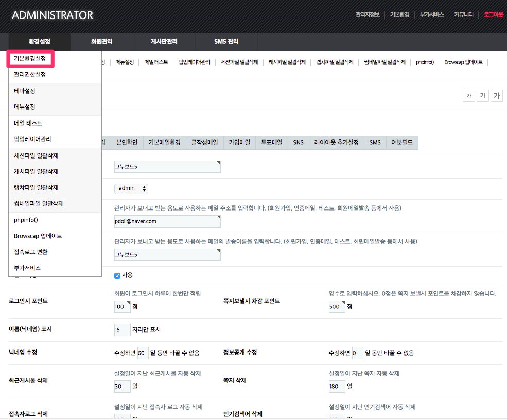
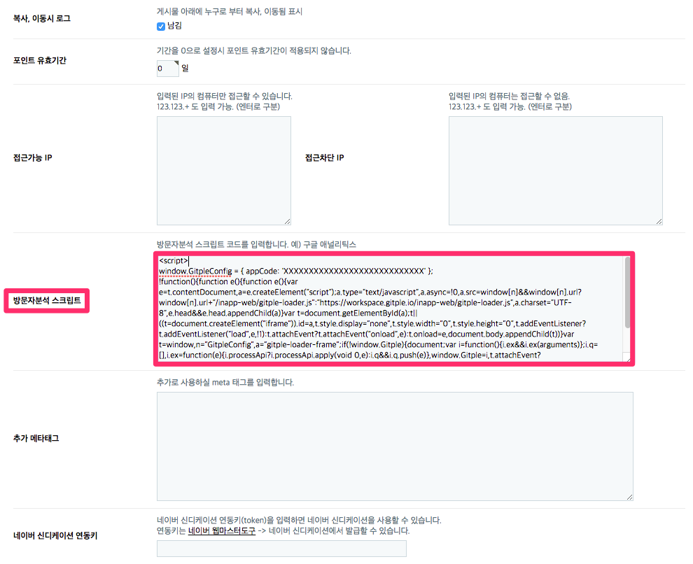
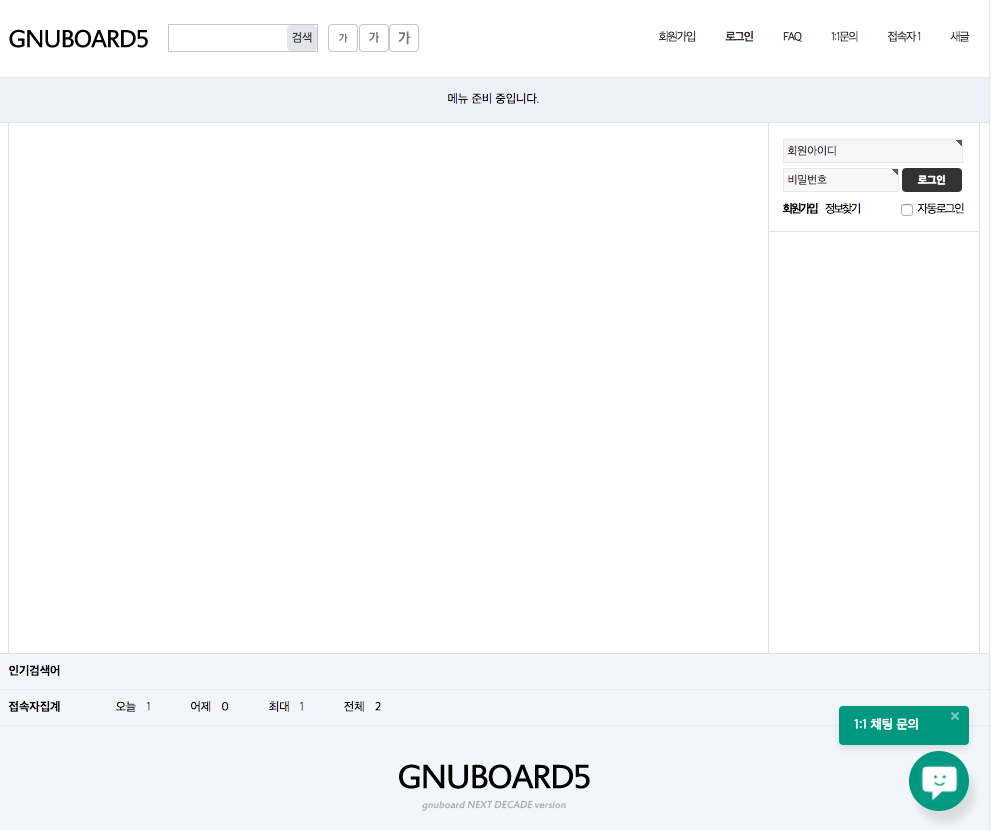

하이브리드 채팅상담 [깃플](https://gitple.io)

# 그누보드5 연동 가이드

- 그누보드란? - https://sir.kr/manual/g5/1
- 그누보드5 설치하기 - https://sir.kr/manual/g5/2

#### 1. 관리자로 로그인 한 후, `관리자 모드` > `환경설정` > `기본환경설정` 을 차례로 실행합니다.



#### 2. HTML 스크립트 복사하기
* 깃플 워크스페이스 > "**설정 > 연동**" > "웹연동 스크립트 코드" 속성에서 HTML 코드 복사
* 그누보드의 기본환경설정 화면에서 "방문자분석 스크립트" 부분을 찾아, 아래 그림과 같이 HTML 코드를 붙여넣음
  

### 서비스 시작

홈페이지에 접속해보시면, (기본) 오른쪽 하단에 여러분 만의 채팅상담 서비스가 가능해진 것을 확인할 수 있습니다.




### 로그인 사용자 연동 방법 안내

[tail.php](https://github.com/gnuboard/gnuboard5/blob/master/theme/basic/tail.php) 파일에서 아래와 같이 스크립트 코멘트들 중에 "하단 끝" 이라고 표기되어 있는 문장을 찾습니다.

그런 후에, 깃플 로그인 예제 시작 부분을 넣으시면 됩니다.

```php
if ($config['cf_analytics']) {
    echo $config['cf_analytics'];
}
?>

<!-- } 하단 끝 -->

<!-- 깃플 로그인 예제 시작 { -->
<script>
<?php
if ($is_member) {
    $unique_id = $member['mb_id']; // 보안을 위해 유추할 수 없는 UUID(소문자), 숫자 등으로 변경해 주세요.
    $mb_id = $member['mb_id'];
    $name = get_text($member['mb_name']);
    $nick = get_text($member['mb_nick']);
    $email = $member['mb_email'];
    printf("
    Gitple('update', {
        id: '%s',
        name: '%s',
        email: '%s',
        meta: {
            '아이디': '%s',
            '별명': '%s'
        }
    });", $unique_id, $name, $email, $mb_id, $nick);
}
?>
</script>
<!-- 깃플 로그인 예제 끝 { -->

```

  * 단, $unique_id 는 보안을 위해 유추할 수 없는 UUID(소문자), 숫자 등으로 변경해 주세요.
  * meta 데이터에는 필요한 값을 추가해 사용하시면 됩니다.
  * [로그인 하지 않은 사용자에서 로그인 사용자로 변경](https://guide.gitple.io/#/web-sdk?id=로그인-하지-않은-사용자에서-로그인-사용자로-변경) 가이드를 참고해주세요.

이상입니다.

아직 계정이 없으시다구요? [무료 회원 가입](https://workspace.gitple.io/#/register)

---


© Gitple Inc. All Rights Reserved.
