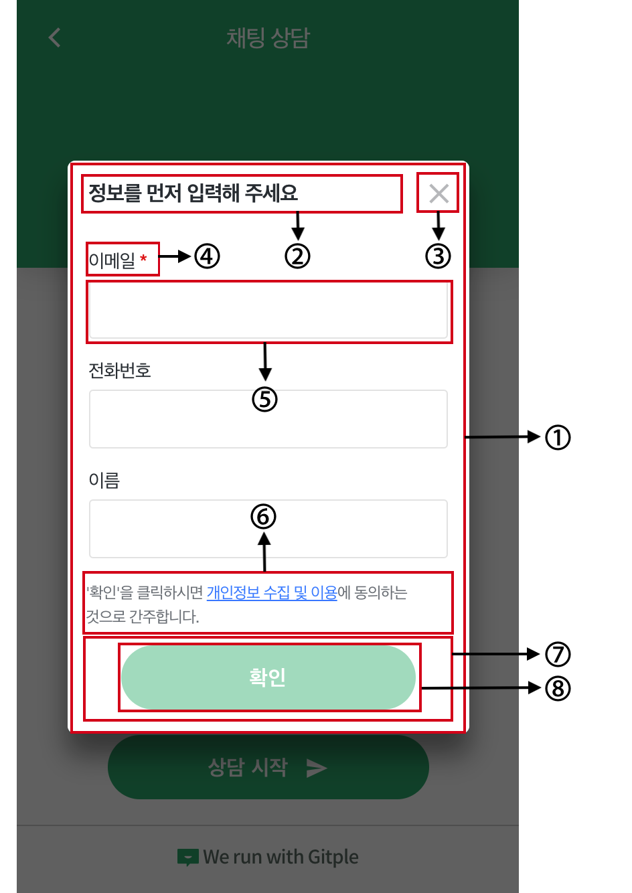

하이브리드 채팅상담 [깃플](https://gitple.io)

# 채팅앱 스타일 적용 가이드

채팅앱의 스타일을 변경하기 위한 가이드 입니다.

실제 서비스에 적용하기 전에 `Chrome 브라우저`의 `개발자 도구`를 이용해서 적용 테스트를 진행할 수 있습니다.

## 채팅앱에서 스타일 변경 적용 방법

### 1. 워크스페이스 접속

워크스페이스로 로그인 후에 "**설정 > 채팅앱**" 메뉴를 선택합니다.


### 2. 커스텀 CSS를 추가

채팅앱 메뉴에서 커스텀 CSS를 `사용함` 으로 변경 후 `gitple_custom.css` 에 CSS를 추가합니다.


### 3. 설정 저장

 수정한 설정을 "**저장하기**" 버튼을 눌려 저장합니다.


## 채팅앱에서 스타일 변경 테스트

### 1. 워크스페이스에서 채팅앱 테스트 실행

워크스페이스로 로그인 후에 "**채팅앱 테스트**" 메뉴를 선택한 후에 채팅앱을 실행합니다.


### 2. 개발자 도구 실행

채팅앱이 실행되면 오른쪽 클릭 후에 "**검사**"를 선택하면 개발자 도구가 실행됩니다.


### 3. gitple_custom.css 소스 열기

실행된 `개발자 도구`의 상단에 `Sources` 메뉴에서 `Open file`을 선택합니다.


그리고 `gitple_custom.css`를 입력하면 해당 파일을 열수 있습니다.


### 4. 스타일 적용하기

열려진 소스에서 각각의 css 클래스에 필요한 속성값을 추가하면 `채팅앱`에 바로 적용됩니다.

추가하는 속성은 반드시 `!important` 속성을 추가해야 실제 값이 반영됩니다. 그리고 `gitple_custom.css` 에 정의된 클래스 이외의 다른 클래스를 추가할 경우 의도하지 않은 스타일로 변경될 수 있습니다. 주의 하시기 바랍니다.

- header의 값을 변경하는 예제

```css

  /* 헤더 배경색상 변경 */
  .gp-header {
    background-color: #3F69AA !important;
  }

  /* 헤더 타이틀 문구 스타일 변경 */
  .gp-header-title {
    font-size: 18px !important;
    color: #fff !important;
    text-align: center;
  }

  /* 헤더 메뉴 버튼 색상 변경 */
  .gp-close-btn,
  .gp-menu-btn {
    color: #fff !important;
  }
```

## 항목별 스타일 변경

### Header

|   |            | CSS Class  |
|---|:-----------|:-----------|
| 1 | Header      | .gp-header |
| 2 | Title Text  | .gp-header-title |
| 3 | Back Button | .gp-close-btn-container .gp-close-btn |
| 4 | Menu Button | .gp-menu-btn-container .gp-menu-btn |

<kbd style="padding: 0; margin: 0; border: none;">
  
</kbd>


#### 1. Background
```css
  .gp-header {
    background-color: #fff !important;
  }
```

#### 2. Title
  
  헤더의 문구는 `워크스페이스`에서 `설정 > 채팅앱` 메뉴의 `타이틀 문구`에서 변경가능합니다. 그리고 아래 CSS Class를 이용해서 속성을 변경하실 수 있습니다.

```css
  .gp-header-title {
    font-size: 18px !important;
    color: #495057 !important;
  }
```

#### 3. Back, Menu Icon

> `gp-close-btn` class의 닫기 버튼은 모바일 환경의 전체화면에서 자동 표시됩니다.

- 버튼 색상 변경
```css
  .gp-menu-btn {
    color: #495057 !important;
  }
  .gp-close-btn {
    color: #495057 !important;
  }
```

- 버튼 모양 변경

  Menu, Back 버튼의 아이콘은 Ionicons을 사용하고 있습니다. 모양을 변경하기 위해서는 아래 링크 문서에서 원하시는 아이콘의 CSS content 값을 복사해서 사용하면 됩니다.
  [Ionicons의 CSS content 값](https://cdn.rawgit.com/driftyco/ionicons/3.0/cheatsheet.html)


```css
  .gp-menu-btn::before {
    content: '\f1c3' !important;
  }

  .gp-close-btn::before {
    content: '\f2c0' !important;
  }
```

- 메뉴의 위치 변경: 왼쪽에 메뉴, 오른쪽에 닫기
```css
  .gp-menu-btn-container {
    left: 0 !important;
    right: auto !important;
  }
  .gp-close-btn-container {
    right: 0 !important;
    left: auto !important;
  }
```


### Home

|   |                             | CSS Class |
|---|:----------------------------|:----------|
| 1 | Header                      | .gp-header |
| 2 | Home body                   | .gp-home-body |
| 3 | Home intro title            | .gp-home-intro-title |
| 4 | Home intro title content    | .gp-home-intro-title-content |
| 5 | Home intro                  | .gp-home-intro |
| 6 | Home intro content          | .gp-home-intro-content |
| 7 | Home start button container | .gp-home-start-container |
| 8 | Home start button           | .gp-home-start-btn |
| 9 | Home footer                 | .gp-home-footer |

<kbd style="padding: 0; margin: 0; border: none;">
  
</kbd>

#### 1. Header

 홈화면 헤더 배경 색상 및 스타일을 변경합니다.

```css
  .gp-header {
    background-color: #3F69AA !important;
  }
```

#### 2. Body
 홈화면의 배경 색상 및 스타일을 변경합니다.

```css
  .gp-home-body {
    background-color: #f8f9fa !important;
  }
```

#### 3. Intro
 홈화면의 안내문구와 안내문구 타이틀은 문구는 `워크스페이스`에서 `설정 > 채팅앱` 메뉴의 `안내문구 타이틀`, `안내문구`에서 변경가능합니다. 그리고 아래 CSS Class를 이용해서 속성을 변경하실 수 있습니다.

 그리고 `안내문구`에서는 **HTML코드의 사용이 가능**합니다.

```css
  .gp-home-intro-title-content {
    color: #fff !important;
    font-size: 30px !important;
  }

  .gp-home-intro-content {
    color: #333 !important;
  }
```

#### 4. Start Button
시작 버튼의 색상 및 스타일을 변경합니다.

```css
  .gp-home-start-btn {
    background-color: #3F69AA !important;
    color: #fff !important;
    font-size: 20px !important;
  }
```

#### 5. Footer
홈화면의 풋터의 색상을 변경합니다.

```css
  .gp-home-footer {
    background-color: #3F69AA !important;
  }
```

### Chat

|   |                        | CSS Class |
|---|:-----------------------|:----------|
| 1 | 채팅 배경 화면            | .gp-chat-body |
| 2 | 상담사/봇/시스템 메시지 영역  | .gp-chat-msg-other .gp-chat-text |
| 3 | 사용자 입력 메시지 영역      | .gp-chat-msg-mine .gp-chat-text |
| 4 | 봇/시스템 메시지 이미지      | .gp-chat-msg-bot-image <br>.gp-chat-msg-sys-image   |
| 5 | 상담사 메시지 이미지        | .gp-chat-msg-agent-image |
| 6 | 메시지 시간               | .gp-chat-msg-time |


<kbd style="padding: 0; margin: 0; border: none;">
  
</kbd>

#### 1. 채팅 배경 화면
채팅시에 배경화면의 색상 및 스타일을 변경합니다.

```css
  .gp-chat-body {
    background-color: #f8f9fa !important;
  }
```

#### 2. 상담사/봇/시스템 메시지 영역
채팅 메시지 중에 상담사 또는 봇 그리고 시스템 안내 메시지에 대한 스타일 변경합니다.

```css
  .gp-chat-msg-other .gp-chat-text {
    background-color: #fff !important;
    border-radius: 4px !important;
    border: solid 1px #e5e9f1 !important;
  }
```

#### 3. 사용자 메시지 영역
채팅 메시지 중에 사용자 메시지에 대한 스타일 변경합니다.

```css
  .gp-chat-msg-mine .gp-chat-text {
    background-color: #092957 !important;
    color: #fff !important;
    border: 0px !important;
    font-weight: bold;
    border-radius: 4px !important;
  }
```

#### 4. 봇/상담사 이미지
채팅 메시지의 이미지를 변경합니다.

> 메시지는 봇, 시스템, 상담사 이미지의 세 가지가 있습니다. 봇, 시스템 이미지는 CSS를 통해서 변경이 가능하지만 상담사 이미지는 `워크스페이스`에서 `설정 > 프로필`에서 업로드한 이미지가 있다면 CSS의 값을 무시되고 업로드한 이미지가 우선 표시됩니다.

```css
  /* 봇, 시스템 이미지 변경 */
  .gp-chat-msg-sys-image, .gp-chat-msg-bot-image {
    background-image: url(https://cdn2.iconfinder.com/data/icons/business-set-2/512/Icon_11-512.png) !important;
  }

  /* 상담사 이미지 변경 */
  .gp-chat-msg-agent-image {
    background-image: url(https://hostingfacts.com/wp-content/uploads/2015/09/customer-support.png) !important;
  }
```

#### 5. 메시지 시간
메시지 시간 표시에 대한 색상 및 스타일을 변경합니다.

사용자 메시지와 봇/상담사 메시지를 구분해서 적용이 가능합니다.

```css
  /* 전체 메시지 시간 표시 변경 */
  .gp-chat-msg-time {
    color: orange !important;
  }
  /* 봇/상담사 메시지 시간 표시 변경 */ 
  .gp-chat-msg-other .gp-chat-msg-time {
    color: red !important;
  }
  /* 사용자 메시지 시간 표시 변경 */ 
  .gp-chat-msg-mine .gp-chat-msg-time {
    color: blue !important;
  }
```

### Chat - Message

|    |                       | CSS Class |
|----|:----------------------|:----------|
| 1  | Text                  | .gp-chat-text |
| 2  | List                  | .gp-chat-obj-list |
| 3  | Form                  | .gp-chat-obj-form |
| 4  | Form label            | .gp-chat-obj-form-label |
| 5  | Form input            | .gp-chat-obj-form-input |
| 6  | Form textarea         | .gp-chat-obj-form-textarea |
| 7  | Button                | .gp-chat-obj-btn |
| 8  | Slide                 | .gp-chat-obj-slide |
| 9  | Suggestion container  | .gp-suggestion |
| 10 | Suggestion button     | .gp-chat-suggestion-btn |

<kbd style="padding: 0; margin: 0; border: none;">
  
</kbd>


#### 1. Text
텍스트 메시지의 색상 및 스타일을 변경합니다. 

> 봇/상담사 메시지 영역(`gp-chat-msg-other`), 사용자 메시지 영역(`gp-chat-msg-mine`)에 따라서 다르게 변경이 가능합니다. 

```css
  /* 봇/상담사 텍스트 메시지 스타일 변경*/
  .gp-chat-msg-other .gp-chat-text {
    background-color: #fff !important;
    border-radius: 4px !important;
    border: solid 1px #e5e9f1 !important;
  }

  /* 사용자 텍스트 메시지 스타일 변경 */
  .gp-chat-msg-mine .gp-chat-text {
    background-color: #092957 !important;
    color: #fff !important;
    border: 0px !important;
    font-weight: bold;
    border-radius: 4px !important;
  }
```

#### 2. List
리스트 메시지의 색상 및 스타일을 변경합니다. 

```css
  /* 리스트 메시지 스타일 변경 */
  .gp-chat-obj-list {
    background-color: #eee !important;
    border-color: orange !important;
  }

  /* 마우스 오버 했을경우 리스트 메시지 스타일 변경 */
  .gp-chat-obj-list:hover {
    background-color: blue !important;
  }
```

#### 3. Form
사용자가 메시지를 남길 때 나오는 입력폼에 대해서 스타일을 변경합니다.

입력폼 안에는 `label`, `input`, `textarea` 의 요소가 있습니다.

```css
  /* Form */
  .gp-chat-obj-form {
    border-color: #3F69AA !important;
  }
  /* Form label */
  .gp-chat-obj-form-label {
    color: #000 !important;
    font-size: 18px !important;
  }
  /* Form input */
  .gp-chat-obj-form-input {
    border-color: #3F69AA !important;
    color: #000 !important;
  }
  /* Form textarea */
  .gp-chat-obj-form-textarea {
    border-color: #3F69AA !important;
    color: gray !important;
  }
```

#### 4. Button
버튼 메시지의 색상 및 스타일을 변경합니다.

```css
  .gp-chat-obj-btn {
    /* 버튼 스타일 변경 */
    font-size: 14px !important;
    background-color: #3F69AA !important;
    border: none !important;
    color: #fff !important;
  }

  /* 마우스 오버 했을경우 버튼 스타일 변경 */
  .gp-chat-obj-btn:hover {
    background-color: blue !important;
  }
```

#### 5. Suggestion
FAQ 봇에서 나오는 제안 버튼에 대해서 색상 및 스타일을 변경합니다.

```css
  /* 제안 컨테이너 배경색 변경 */
  .gp-suggestion {
    background-color: #f8f9fa !important;
  }
   
  /* 제안 버튼 스타일 변경 */
  .gp-chat-suggestion-btn {
    background-color: #3F69AA !important;
    color: #fff !important;
    border: none !important;
  }

  /* 마우스 오버 했을경우 제안 버튼 스타일 변경 */
  .gp-chat-suggestion-btn:hover {
    background-color: blue !important;
  }
```

### Chat Footer

#### 채팅중일 때의 Footer

|   |                     | CSS Class  |
|---|:--------------------|:-----------|
| 1 | Footer              | .gp-chat-footer |
| 2 | File upload icon    | .gp-chat-footer-file-btn .gp-chat-footer-file-icon |
| 3 | Message input       | .gp-chat-footer-input |
| 4 | Emoticon button     | .gp-chat-footer-emoticon-btn |
| 5 | Message send icon   | .gp-chat-footer-send-icon |

<kbd style="padding: 0; margin: 0; border: none;">
  
</kbd>

#### 1. Footer
```css
  .gp-chat-footer {
    background-color: #f8f9fa !important;
  }
```

#### 2. File upload icon
- 파일 첨부 버튼의 스타일을 변경합니다.
```css
  /* 파일 첨부 버튼을 표시하지 않도록 변경합니다. */
  .gp-chat-footer-file-btn {
    display: none !important;
  }
```

- 파일 첨부 아이콘의 색상 및 스타일을 변경합니다.
```css
  .gp-chat-footer-file-icon {
    color: #3F69AA !important;
  }
```

#### 3. Message input
메시지 입력 Input에 대해서 스타일을 변경합니다.
```css
  .gp-chat-footer-input {
    background-color: #f8f9fa !important;
    color: orange !important;
  }
```

#### 4. Emoticon button
> 이모티콘 보기 버튼은 색상 스타일 변경은 불가능합니다. 다만 이모티콘을 사용하지 않을 경우는 `display` 속성을 `none`으로 변경하여서 보이지 않도록 할수 있습니다.

```css
  .gp-chat-footer-emoticon-btn {
    display: none !important;
  }
```

#### 5. Message send icon
메시지 전송 아이콘의 색상 및 스타일을 변경합니다.
```css
  .gp-chat-footer-send-icon {
    color: #3F69AA !important;
  }
```


#### 채팅 종료 때의 Footer

|   |             | CSS Class  |
|---|:------------|:-----------|
| 1 | Footer      | .gp-chat-footer-static |
| 2 | Button      | .gp-chat-footer-btn |

<kbd style="padding: 0; margin: 0; border: none;">
  
</kbd>

#### 1. Footer

```css
  .gp-chat-footer-static {
    background-color: lightgrey !important;
  }
```

#### 2. Button

```css
  .gp-chat-footer-btn {
    color: #fff !important;
    background-color: #3F69AA !important;
  }
```

### Anonymous Modal

익명 사용자가 상담 시작을 요청할 경우에 보이는 정보 입력 창입니다.
입력 사용자의 입력 필드의 설정은 `워크스페이스`에서 `설정 > 채팅앱` 메뉴의 `방문객` 설정에서 변경하실 수 있습니다.

|   |                     | CSS Class |
|---|:--------------------|:----------|
| 1 | Modal               | .gp-home-anonymous-modal |
| 2 | Modal Title         | .gp-home-anonymous-modal-title |
| 3 | Modal Close Button  | .gp-home-anonymous-modal-close |
| 4 | Input Field Label   | .gp-home-anonymous-label |
| 5 | Input Field Input   | .gp-home-anonymous-input |
| 6 | Privacy Terms Text  | .gp-home-anonymous-privacy-terms |
| 7 | Ok Button Container | .gp-home-anonymous-btn-container |
| 8 | Ok Button           | .gp-home-anonymous-btn |

<kbd style="padding: 0; margin: 0; border: none;">
  
</kbd>


### gitple_custom.css 예제
<kbd style="padding: 0; margin: 0; display: inline-block;">
  
</kbd>
<kbd style="padding: 0; margin: 0; display: inline-block;">
  
</kbd>

<!--  -->

```css
 /**
  * Gitple Custom Styles
  * Must to use "!important" for all attributes.
  */

  .gp-header {
    background-color: #3F69AA !important;
  }

  .gp-header-title {
    font-size: 18px !important;
    color: #fff !important;
    text-align: center;
  }

  .gp-close-btn,
  .gp-menu-btn {
    color: #fff !important;
  }

  .gp-home-intro-title {
    color: #fff !important;
  }

  .gp-home-start-btn {
    background-color: #3F69AA !important;
  }

  .gp-home-footer {
    background-color: #eee !important;
  }

  .gp-home-anonymous-btn {
    background-color: #3F69AA !important;
  }

  /* chat page: body */
  .gp-chat-body {
    background-color: #f8f9fa !important;
  }

  /* chat page: message box for user */
  .gp-chat-msg-mine .gp-chat-text {
    background-color: #092957 !important;
    color: #fff !important;
    border: 0px !important;
    font-weight: bold;
    border-radius: 4px !important;
  }

  .gp-chat-msg-other .gp-chat-text {
     background-color: #fff !important;
    border-radius: 4px !important;
    border: solid 1px #e5e9f1 !important;
  }

  .gp-chat-msg-emoticon {
    background-color: transparent !important;
  }

  .gp-chat-msg-emoticon .gp-chat-obj {
    background-color: transparent !important;
  }


  /* chat page: message box for object list */
  .gp-chat-obj-list {
    font-size: 14px !important;
  }

  /* chat page: message box for object button */
  .gp-chat-obj-btn {
    font-size: 14px !important;
    background-color: #3F69AA !important;
    border: none !important;
    color: #fff !important;
  }

  .gp-suggestion {
     background-color: #f8f9fa !important;
  }

  .gp-chat-footer-file-icon {
    color: #333333 !important;
  }

  .gp-chat-footer-send-icon {
    color: #333333 !important;
  }

  .gp-chat-footer-btn {
    color: #fff !important;
    background-color: #3F69AA !important;
  }
```


이상입니다.

아직 계정이 없으신가요? [무료 회원 가입](https://workspace.gitple.io/#/register)

---

© Gitple Inc. All Rights Reserved.
