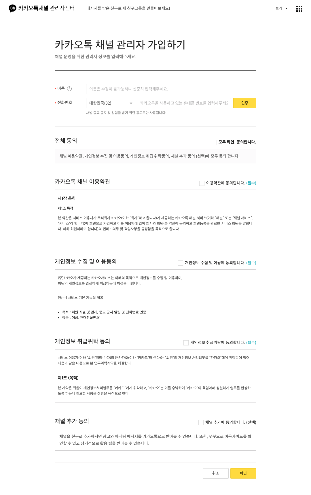
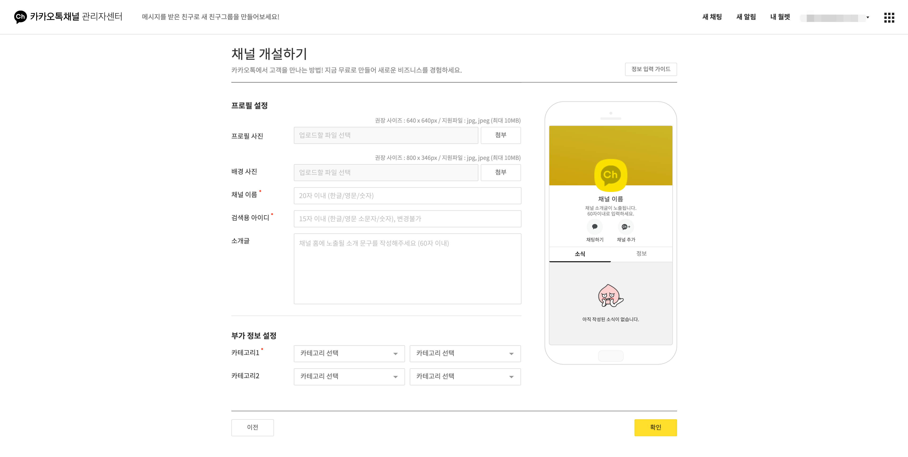
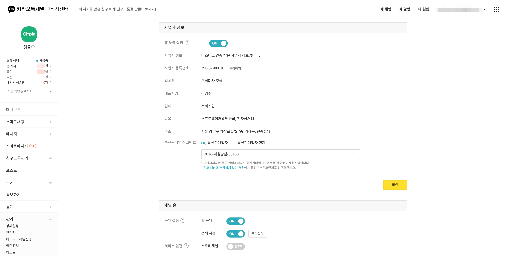
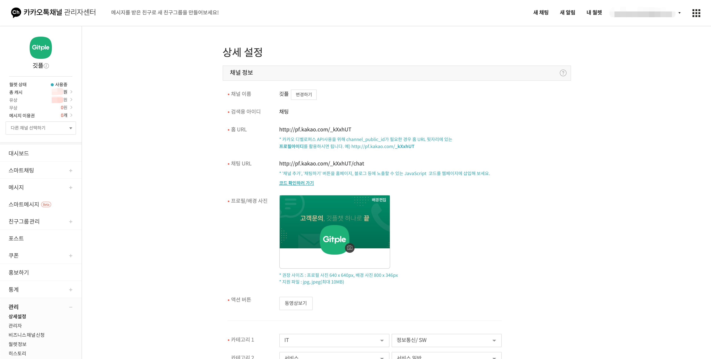

하이브리드 채팅상담 [깃플](https://gitple.io)

# 카카오톡 채널

카카오톡 채널 연동을 이용하기 위해서는 깃플챗의 회원가입 뿐만 아니라, 카카오 비즈니스 채널 등록이 필요합니다.

연동 순서는 **`카카오톡 채널 가입 > 워크스페이스 연동`** 입니다.

필요에 따라 **`카카오톡 상담 버튼`** 을 사이트에 추가할 수도 있습니다.

### 카카오톡 채널 가입
1. [카카오톡 비즈니스 채널](https://accounts.kakao.com/login/kakaoforbusiness) 사이트에서 회원 가입을 해주세요.

    

2. 카카오톡 채널 관리자 가입
  * **`카카오톡 채널 만들기`** 를 클릭해주세요.

    
    

3. 카카오톡 채널 개설
  * **`카카오톡 채널 개설`** 을 클릭해주세요.
  * **`검색용 아이디`** 가 워크스페이스 연동에 사용됩니다.

    
    

4. 1:1 채팅 사용 설정
  * **`대시보드 > 1:1 채팅 > 1:1 채팅 사용`** 을 꼭 ON 해주세요.

    

5. 비즈니즈 채널 신청
  * **`관리 > 비즈니스 채널 신청`** 을 필수로 진행해주세요!

    
    

6. 사업자 정보 공개, 채널 홈 공개, 상담원 연결 공개 설정
  * **`관리 > 상세설정 > 사업자 정보 > 홈 노출 설정`** 을 꼭 ON 해주세요!!

    

  * **`관리 > 상세설정 > 채널 홈 > 홈 공개, 검색 허용`** 을 꼭 ON 해주세요!!
  * **`관리 > 상세설정 > 채널 채팅방 > 상담직원 연결버튼`** 을 꼭 ON 해주세요!!

    

7. 채널 ID 확인
  * **`검색용 아이디`** 가 워크스페이스 연동에 사용됩니다.

    

### 워크스페이스 연동 설정

1. 카카오톡 채널 관리자센터 **`관리 > 상세 설정 > 검색용 아이디`** 를 참고하여, 워크스페이스 **`설정 > 연동 > 카카오톡 채널 ID`** 에 해당 값을 입력합니다.

2. **`등록하기`** 버튼을 클릭해주세요.

    

    * 카카오톡 채널 ID
      * 카카오 채널에서 설정한 검색용 아이디입니다.
    * 등록 상태는 `Receipt > Progress > Success` 단계로 나누어지며, Success 상태가 되면 연동이 끝난 상태로 카카오톡 채팅을 통한 워크스페이스 상담이 가능합니다.

3. 등록 신청 후 워크스페이스에서 바로 채팅문의로 주시거나, help@gitple.com 으로 메일주시면 됩니다.

### 카카오톡 상담 버튼 연동
상담 버튼 연동은 두가지 방법이 있습니다.
- 상담톡 버튼 연동
  - 상담톡 버튼 연동 시 **`검색용 아이디`** 가 필요합니다.
    ```javascript
    url: https://bizmessage.kakao.com/chat/open
    method: POST
    body: {
      uuid: @검색용 아이디, //'@' + 검색용 아이디
      extra: 메타정보 // text(1000)
    }
    ```
  - 아래 스크립트를 추가해주세요.
    - 버튼 이미지는 깃플에서 기본으로 제공합니다. (다른 카카오톡 이미지로 변경하실 수도 있습니다.)
    - [카카오톡 버튼 이미지 다운로드](https://developers.kakao.com/buttons#kakao-talk-channel-buttons) 에서 버튼에 사용할 이미지를 다운받을 수 있습니다.

    ```javascript
    <script>
    window.GitpleKakao = {
      uuid: '@채팅' //'@' + 검색용 아이디
    };

    (function () {
      function gitpleKakaoTalkLoader() {
        openKakaotalk = function () {

          const kakaoForm = document.createElement('form');
          const gitpleKakao = window.GitpleKakao;

          if (!gitpleKakao || !gitpleKakao['uuid']) {
            console.warn('[GitpleKakao] window.GitpleKakao or GitpleKakao.uuid is undefined')
            return;
          }

          kakaoForm.setAttribute('method', 'post');
          kakaoForm.setAttribute('action', 'https://bizmessage.kakao.com/chat/open');
          kakaoForm.setAttribute('target', 'kakaoView');

          let hiddenField  = document.createElement('input');
          hiddenField.setAttribute('type', 'hidden');
          hiddenField.setAttribute('name', 'uuid');
          hiddenField.setAttribute('value', window.GitpleKakao['uuid']);
          kakaoForm.appendChild(hiddenField);
          document.body.appendChild(kakaoForm);

          window.open(
            '',
            'kakaoView',
            );

          kakaoForm.submit();
        }

        const kakaoLauncherId = 'kakao-launcher';
        const kakaoLauncherIconId = 'kakao-launcher-icon';
        const kakaoLauncherCustomIconId = 'kakao-launcher-custom-icon';
        const styleCss = '#' + kakaoLauncherId + ' {' +
            '  z-index: 9999989; display: block; position: fixed; ' +
            ' right: 20px !important;' + ' bottom: 20px;' +
            '} ' + '#' + kakaoLauncherIconId + ' {' +
              '  cursor: pointer; ' +
              '  width: 60px; ' +
              '  height: 60px; ' +
              '  border-radius: 30px; ' +
              '  -moz-box-shadow: 0px 6px 20px rgba(0, 0, 0, 0.1); ' +
              '  webkit-box-shadow: 0px 6px 20px rgba(0, 0, 0, 0.1); ' +
              '  box-shadow: 0px 6px 20px rgba(0, 0, 0, 0.1); ' +
              '  transition: all 0.12s; ' +
              '  padding: 0 !important; ' +
              '  -webkit-animation: kakao-launcher-appear .50s ease !important; ' +
              '  animation: kakao-launcher-appear .50s ease !important ' +
              '} ' +
              '#' + kakaoLauncherCustomIconId + ' {' +
              '  cursor: pointer; ' +
              '  transition: all 0.12s; ' +
              '  padding: 0 !important; ' +
              '  display: inline; ' +
              '  max-width: 100%; ' +
              '  height: auto;' +
              '} ' +
              '@-webkit-keyframes kakao-launcher-appear { ' +
              '  0% { ' +
              '    opacity: 0; ' +
              '    -webkit-transform: scale(.5); ' +
              '    transform: scale(.5) ' +
              '  } ' +
              '  to { ' +
              '    opacity: 1; ' +
              '    -webkit-transform: scale(1); ' +
              '    transform: scale(1) ' +
              '  } ' +
              '} ' +
              '@keyframes kakao-launcher-appear { ' +
              '  0% { ' +
              '    opacity: 0; ' +
              '    -webkit-transform: scale(.5); ' +
              '    transform: scale(.5) ' +
              '  } ' +
              '  to { ' +
              '    opacity: 1; ' +
              '    -webkit-transform: scale(1); ' +
              '    transform: scale(1) ' +
              '  } ' +
              '} ';
        let styleElmt = document.createElement('style');
        styleElmt.type = 'text/css';
        styleElmt.innerHTML = styleCss;
        document.head.appendChild(styleElmt);

        const launcherContainer = document.createElement('div'),
        launcherIcon = document.createElement('div');

        launcherContainer.id = kakaoLauncherId;

        // launcher icon
        launcherIcon.id = kakaoLauncherIconId;
        launcherIcon.addEventListener('click', openKakaotalk, false);

        // launcher position
        launcherContainer.style.left = 'none';
        launcherContainer.style.right = '20px';

        // launcher custom icon
        const customIcon = document.createElement('img');
        customIcon.id = kakaoLauncherCustomIconId;
        customIcon.setAttribute('src', 'https://s3.ap-northeast-2.amazonaws.com/www.gitple.io/icon-kakao-talk.png');
        customIcon.setAttribute('srcset', 'https://s3.ap-northeast-2.amazonaws.com/www.gitple.io/icon-kakao-talk%402x.png 2x');
        launcherIcon.appendChild(customIcon);

        launcherContainer.appendChild(launcherIcon);

        if (document.body) {
          document.body.appendChild(launcherContainer);
        }
      }

      if(window.attachEvent){
        window.attachEvent('onload', gitpleKakaoTalkLoader);
      }else{
        window.addEventListener('load', gitpleKakaoTalkLoader, false);
      }
    }());
    </script>
    ```

- 카카오톡 스크립트 버튼 연동
  - 카카오톡 스크립트  버튼 연동 시 **`채널 홈 URL ID`** 와 **`KaKao Developers App`** 이 필요합니다.
  - [KaKao Developers 앱](https://developers.kakao.com/docs/js/getting-started) 에서 앱을 등록해주세요.
  - 앱 등록 후 [KaKao Developers 버튼](https://developers.kakao.com/docs/js/plusfriend) 에 따라 버튼을 추가하실 수 있습니다.

  ```html
  <!DOCTYPE html>
  <html>
  <head>
  <meta charset="utf-8"/>
  <meta http-equiv="X-UA-Compatible" content="IE=edge"/>
  <meta name="viewport" content="user-scalable=no, initial-scale=1.0, maximum-scale=1.0, minimum-scale=1.0, width=device-width"/>
  <title>Kakao Talk Channel Chat Button Demo - Kakao JavaScript SDK</title>
  <script src="//developers.kakao.com/sdk/js/kakao.min.js"></script>

  </head>
  <body>
  <a href="javascript:void chatChannel()">
    
  </a>
  <script type='text/javascript'>
    //<![CDATA[
      // 사용할 앱의 JavaScript 키를 설정해 주세요.
      Kakao.init('YOUR APP KEY');
      function chatChannel() {
        Kakao.Channel.chat({
          channelPublicId: '_xcLqmC' // 카카오톡 채널 홈 URL에 명시된 id로 설정합니다.
        });
      }
    //]]>
  </script>

  </body>
  </html>
  ```

---

© Gitple Inc. All Rights Reserved.
