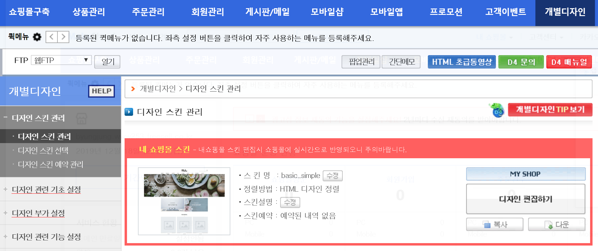
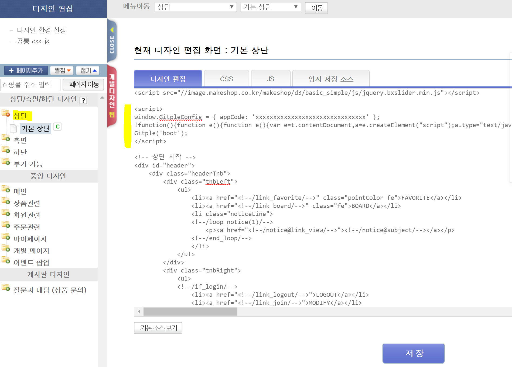
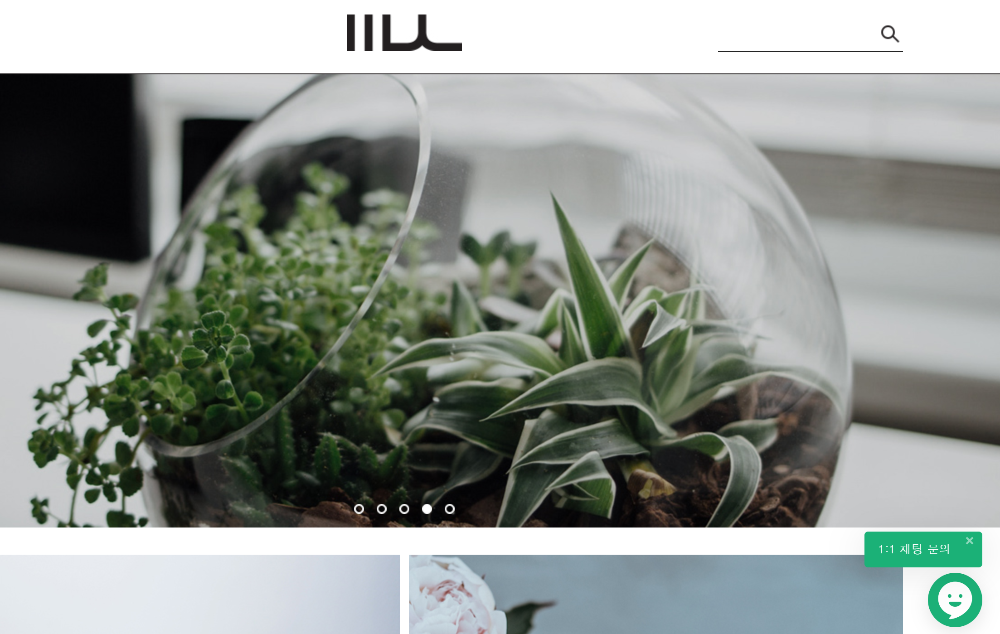

하이브리드 채팅상담 [깃플](https://gitple.io)

# 메이크샵(MakeShop) 연동 가이드

메이크샵 주소 - https://www.makeshop.co.kr/

#### 1. 관리자 페이지에 접속한 후, `개별디자인` > `디자인 편집하기` 

#### 2. 아래 그림처럼 왼쪽 메뉴에서 `상단`을 선택 후, HTML 스크립트 복사하기

* 깃플 워크스페이스 > "**설정 > 연동**" > "웹연동 스크립트 코드" 속성에서 HTML 코드 복사해서 붙여넣기

!> 붙여넣기를 하신 후에, 아래 `저장` 하기를 잊지 마세요.

### 서비스 시작

홈페이지에 접속해보시면, (기본) 오른쪽 하단에 여러분 만의 채팅상담 서비스가 가능해진 것을 확인할 수 있습니다.

이상입니다.

아직 계정이 없으시다구요? [무료 회원 가입](https://workspace.gitple.io/#/register)

---

© Gitple Inc. All Rights Reserved.
