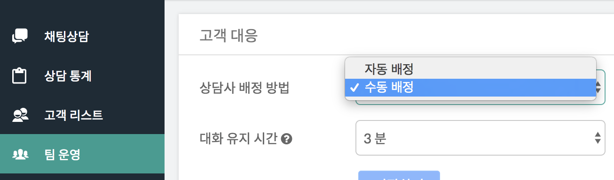
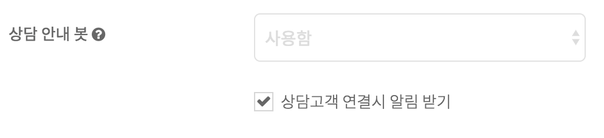
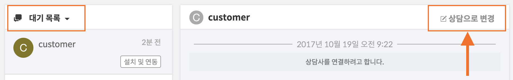
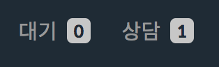

하이브리드 채팅상담 [깃플](https://gitple.io)

## 수동 배정

수동 배정 방식은 고객의 문의를 상담사가 실시간으로 응대하는 것이 어렵기 때문에, 모든 상담들을 우선 상담 **대기**열에 두는 방식입니다.

아래의 상황에서는 수동 배정을 사용하시면 편리합니다.
- 고객 문의량이 어느 정도 있지만, 전담 상담사를 운영하기에는 부담스러운 상황입니다.
- 고객 문의가 특정 시즌에만 집중되는 형태라, 그 외의 시즌에는 전담 상담사를 대신할 수 있는 솔루션이 필요합니다.
- 아직 서비스 정식 출시전이지만, 테스트 기간에 발생하는 고객 문의도 24시간 적극 수용할 필요가 있는 있는 상황입니다.
- 외부 미팅을 하는 동안에도 사무실에 전문 상담사가 있는 것 처럼 고객 서비스를 제공하고 싶습니다.

#### 설정 방법
수동 배정 방법은 아래와 같이 설정하면 됩니다.

또한 상담 대기열에 상담이 추가되면 알림을 받을 수 있는데, 알림을 받기 위해서는 [상담 안내 봇](ws-settings-inapp.md) 설정에서 '상담고객 연결시 알림 받기'를 활성화해 주어야 합니다.

#### 상담 배정 방법
상담 대기열에 들어온 상담을 상담사에게 배정하기 위해서는 워크스페이스의 `대기목록` 오른쪽에 위치한 `상담으로 변경` 버튼을 누르면 됩니다.

이제 아래와 같이 상담열로 이동되어서 채팅상담이 가능한 상태가 됩니다.

이상입니다. 추가로 궁금한 사항이 있으면 언제든지 채팅상담 눌러서 말씀주세요!

!> 상담 수가 증가하여 전담 상담사가 필요하게 된다면?  [자동 배정](./autorouting.md)

---

© Gitple Inc. All Rights Reserved.
