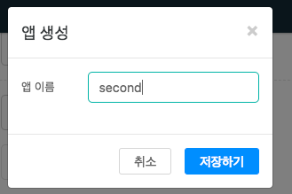
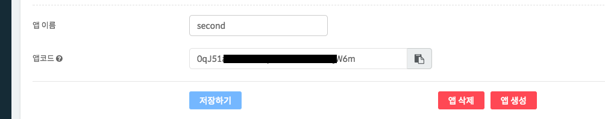
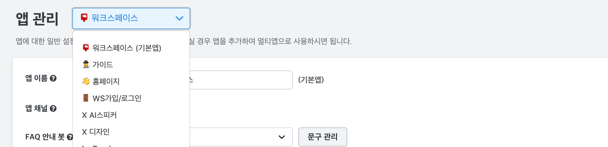
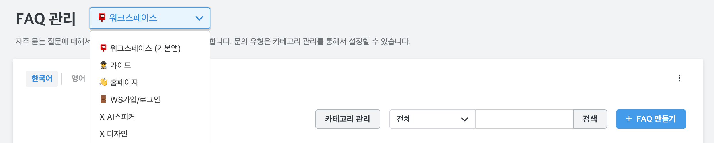

하이브리드 채팅상담 [깃플](https://gitple.io)

## 멀티 앱 (= 멀티 브랜드)

?> 다수의 web, mobile의 앱들로부터 들어오는 상담 요청을 사용자 그룹별, 카테고리별, 앱별로 구분하여 하나의 워크스페이스에서 각각의 web, mobile 앱 별로 독립적으로 관리할 수 있는 기능

* 사용 예시
  - 서로 다른 성격의 홈페이지가 여러개 있어서, 개별적으로 FAQ 데이터 설정을 해야하는 경우
  - 상담 고객이 여러 언어(혹은 지역)에서 들어올 때, 이를 확실히 구분하고 싶을 경우 
  - 홈페이지이 외에도 안드로이드, 아이폰 앱 등 별도로 데이터를 확인하고 싶은 경우

### 앱 생성 하기

  - "**설정 > 앱 관리**" 메뉴에 "**앱 추가하기**" 버튼이 있습니다.
  - 실행하면 아래와 같이 원하시는 앱 이름을 입력하시면 됩니다. 

      

?> 이모지 활용팁! https://emojipedia.org/ 에서 이모지(예. 😃)를 글자처럼 복사해서 앱 이름 설정시 앞에 붙여주면 앱간 구분이 쉬워집니다. 

### 멀티 앱 사용방법

  

  * 앱을 생성하게되면, 위 그림과 같이 새로운 **앱 코드**가 발급된 것을 확인할 수 있습니다.
  * 해당 새로운 **앱 코드**는 연동 할때 쓰이며, 
  [연동 리스트](sdk-list.md)을 참고하여, 원하는 서비스에 앱 코드와 함께 입력합니다.

  ?> 앱을 2개 이상 생성시, 이제부터는 개별적으로 설정이 적용됩니다.   
  아래 그림과 같이 오른쪽 상단에 메뉴를 통해서 현재 앱을 확인할 수 있습니다. 

  


  * 또한, 필요시 다른 페이지에서도 앱을 구분해서 확인할 수 있도록 되어있습니다. ( [태그](ws-tags), [FAQ](ws-faq), [배정](ws-settings-routing.md), [업무 시간](ws-settings-hours.md) 등)

  


<br>
<br>
<br>

##### 한 사이트에서 앱코드 전환하기 html 예제

``` html
<!DOCTYPE HTML>
<html>
<head>
  <title>Gitple Web Integration</title>
  <meta charset="UTF-8">
  <meta name="viewport" content="width=device-width, initial-scale=1.0, minimum-scale=1.0, maximum-scale=1.0, user-scalable=no">
<script>

  /** Gitple Scripts **/
  !function(){function e(){function e(){var e=t.contentDocument,a=e.createElement("script");a.type="text/javascript",a.async=!0,a.src=window[n]&&window[n].url?window[n].url+"/inapp-web/gitple-loader.js":"https://app.gitple.io/inapp-web/gitple-loader.js",a.charset="UTF-8",e.head&&e.head.appendChild(a)}var t=document.getElementById(a);t||((t=document.createElement("iframe")).id=a,t.style.display="none",t.style.width="0",t.style.height="0",t.addEventListener?t.addEventListener("load",e,!1):t.attachEvent?t.attachEvent("onload",e):t.onload=e,document.body.appendChild(t))}var t=window,n="GitpleConfig",a="gitple-loader-frame";if(!window.Gitple){document;var i=function(){i.ex&&i.ex(arguments)};i.q=[],i.ex=function(e){i.processApi?i.processApi.apply(void 0,e):i.q&&i.q.push(e)},window.Gitple=i,t.attachEvent?t.attachEvent("onload",e):t.addEventListener("load",e,!1)}}();

  function openGitple(appId) {
    const apps = {
      app1: {
        appCode: 'xxxxxxxxxxxxxxxxxxxxxxxxxxxxxx'
      },
      app2: {
        appCode: 'yyyyyyyyyyyyyyyyyyyyyyyyyyyyyy'
      },
      app3: {
        appCode: 'zzzzzzzzzzzzzzzzzzzzzzzzzzzzzz'
      }
    }

    // shutdown privous booted chatting app
    Gitple('shutdown');

    window.GitpleConfig = apps[appId];

    // boot and open chatting app
    Gitple('boot');
    Gitple('open');
  }
  
</script>
<link rel="stylesheet" href="https://maxcdn.bootstrapcdn.com/bootstrap/4.0.0-beta.2/css/bootstrap.min.css" integrity="sha384-PsH8R72JQ3SOdhVi3uxftmaW6Vc51MKb0q5P2rRUpPvrszuE4W1povHYgTpBfshb" crossorigin="anonymous">
</head>
<body>
  <div class="row justify-content-md-center mt-5">
    <div class="col-12 text-center">
      <h2>GITPLE Apps Integration Example</h2>
    </div>
  </div>
  <div class="row justify-content-md-center mt-5">
    <div class="col-2 text-center">
      <div class="form-group">
        <button type="button" class="btn btn-outline-primary" onclick="javascript:openGitple('app1');">open app 1</button>
      </div>
    </div>
    <div class="col-2 text-center">
      <div class="form-group">
        <button type="button" class="btn btn-outline-secondary" onclick="javascript:openGitple('app2');">open app 2</button>
      </div>
    </div>
    <div class="col-2 text-center">
      <div class="form-group">
        <button type="button" class="btn btn-outline-success" onclick="javascript:openGitple('app3');">open app 3</button>
      </div>
    </div>
  </div>
</body>
</html>
```

---

© Gitple Inc. All Rights Reserved.
