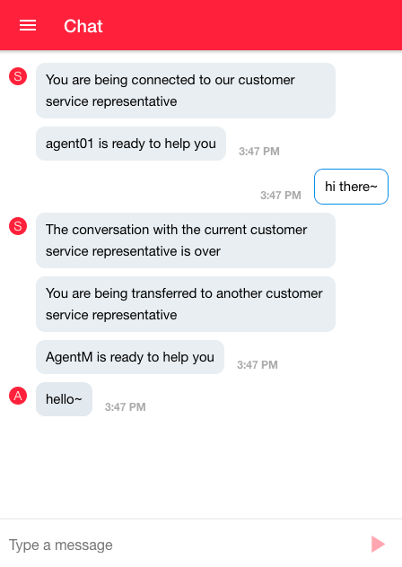
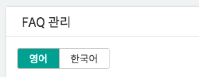
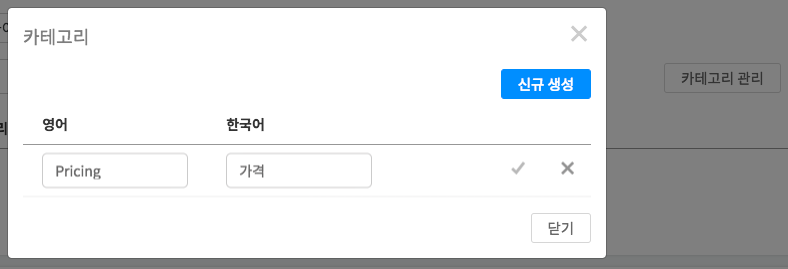
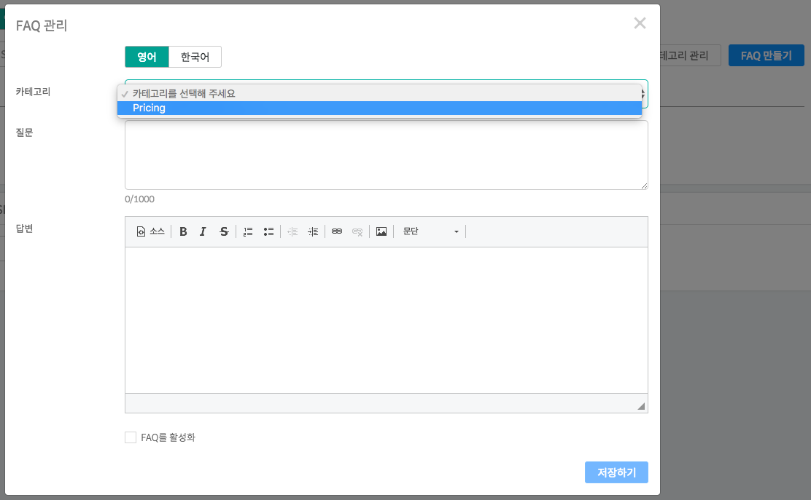
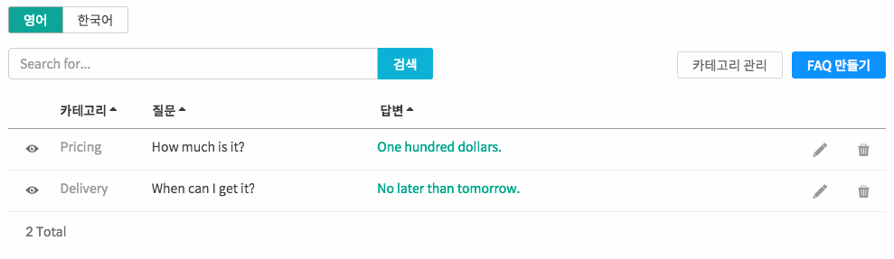
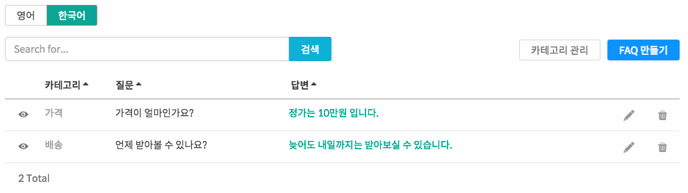
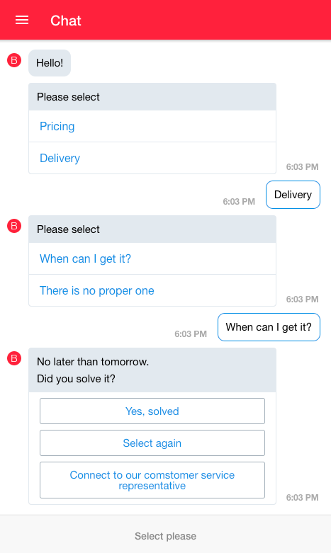
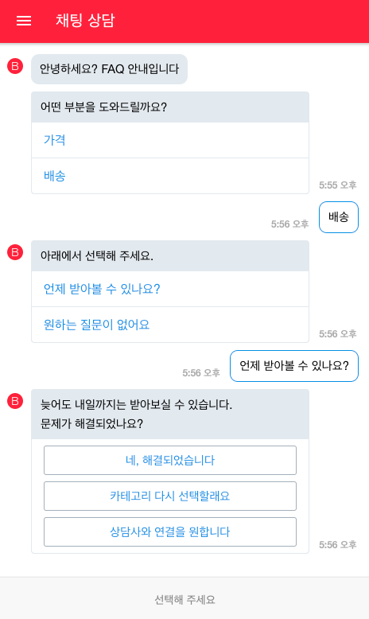

하이브리드 채팅상담 [깃플](https://gitple.io)

## 다국어 고객지원

채팅앱의 경우, 현재 한국어외에 영어, 중국어, 일본어를 지원합니다.

?> 본 가이드는 영어를 국제통용어(International Language)로 가정하고 설명합니다.

### 1. 영어를 기본언어로 변경 
영어가 아직 추가 안되었다면, "**설정 > 채팅앱 > 채팅앱 지원 언어**" 속성에서 "영어" 를 선택해서 추가

기본 언어가 영어가 아니면, 영어를 `기본 언어`로 변경 

위와 같이 영어가 기본 언어로 된 것을 확인합니다.

### 2. 채팅앱 영어 동작 확인

* 위와 같이 영어로 채팅앱의 언어가 변경된 것을 확인합니다.
  - 시작 문구, 툴팁 안내 등의 다국어 설정은 워크스페이스 "**설정 > 채팅앱**" 에서 가능합니다.

### 3. FAQ 다국어 설정
우선, 아래와 같이 FAQ 관리에서 다국어 탭(영어, 한국어)이 보이는지 확인합니다.

**카테고리 관리**에서 카테고리를 신규 생성합니다.

**FAQ 만들기**에서 언어별로 항목을 만들어 봅니다.
  - 영어와 한국어 탭 각각에서 입력한 후에 저장을 하시면 됩니다. 
     

  - 아래 나오는 예시와 같이 해봅니다.

| 언어 | 예시 | 
|--------| -------|
| 영어 |  | 
| 한국어 |  | 

### 4. 동작 확인
| 영어 | 한국어 | 
|--------| -------|
|  |  |

---

© Gitple Inc. All Rights Reserved.
