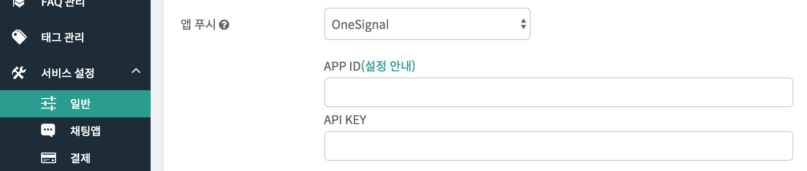
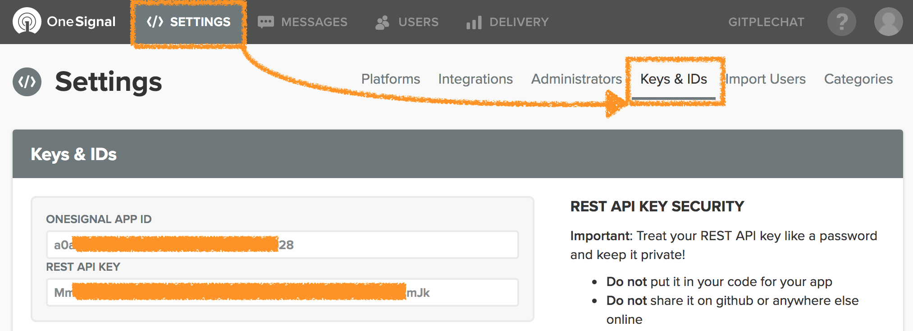

하이브리드 채팅상담 [깃플](https://gitple.io)

## Push SDK

?> 모바일 앱에 푸시(Push)기능을 연동하는 가이드 입니다. 

### OneSignal
[OneSignal](https://onesignal.com) 에서는 모든 모바일 플랫폼에 최적화된 Push SDK를 제공하고 있습니다.
자체적으로 Push 기능이 없는 모바일앱의 경우에, 깃플에서 기본으로 권장드리는 푸시 솔루션입니다.

#### 워크스페이스 설정

  - "**설정 > 연동**" 에서 위 그림과 같이 **모바일 푸시** 설정을 확인 하실 수 있습니다.
  - APP ID 와 API KEY 값은 아래 그림과 같이 OneSignal 페이지에 접속하면 확인가능합니다.

  
  
  - 해당 값을 복사해서 입력한 후에, 맨 아래 저장 버튼을 눌러주시면 끝입니다.

#### 모바일 앱 설정 
- OneSignal 초기화하는 코드 이후에 **OneSignal Tag 를 전송** 해야 합니다. 
  * key
    - gp
  * value
    - 깃플 회원연동시 사용할 ID (`ID가 숫자일 경우 문자열로 변경필요`)
  * Android 예시

    ```OneSignal.sendTag("gp", "loginId");```
  * 참고문서
    - [onesignal tag](https://github.com/OneSignal/react-native-onesignal#sending-and-getting-onesignal-tags)

- Push 메시지 수신시 **Gitple 에서 보낸 메시지인지 확인**하는 방법
  * notification received 이벤트에서 notification.payload.additionalData 에 다음 값을 확인하면 됩니다.

    ```{"from" : "gp"}```
  * 참고 문서
    - [onesignal handling notification](https://github.com/OneSignal/react-native-onesignal#handling-notifications)
    - [onesignal notification data](https://documentation.onesignal.com/reference#section-attachments)

?> 아래는 추가 정보입니다.

#### OneSignal에서 앱이 foreground일 경우 알림표시 옵션

##### Android

'setInFocusDisplaying'  메소드를 설정

  - Notification : 앱이 포커스된 상태에서도 기본 알림을 표시
  - InAppAlert (DEFAULT) : 앱이 포커스된 상태에서는 alert 메세지로 표시
  - None: 앱이 포커스된 상태에서는 알림을 표시하지 않음

```
// OneSignal 초기화 코드에 추가하는 예제
OneSignal.setInFocusDisplaying(OneSignal.OSInFocusDisplayOption.Notification);
```

  참고 링크: https://documentation.onesignal.com/docs/android-native-sdk#section--setinfocusdisplaying-

##### iOS 

Objective-C 옵션

- OSNotificationDisplayTypeNotification - Native notification display
- OSNotificationDisplayTypeInAppAlert (DEFAULT) - Alert dialog display.
- OSNotificationDisplayTypeNone - Notification is silent and not shown

Swift 옵션:
- OSNotificationDisplayType.notification
- OSNotificationDisplayType.inAppAlert
- OSNotificationDisplayType.none

```
// Swift에서 설정 예제
OneSignal.inFocusDisplayType = OSNotificationDisplayType.notification
```

```
// Objective-C에서 설정 예제
OneSignal.inFocusDisplayType = OSNotificationDisplayTypeNotification;
```

참고링크 : https://documentation.onesignal.com/docs/ios-native-sdk#section--infocusdisplaytype-

이상입니다.

---

© Gitple Inc. All Rights Reserved.
