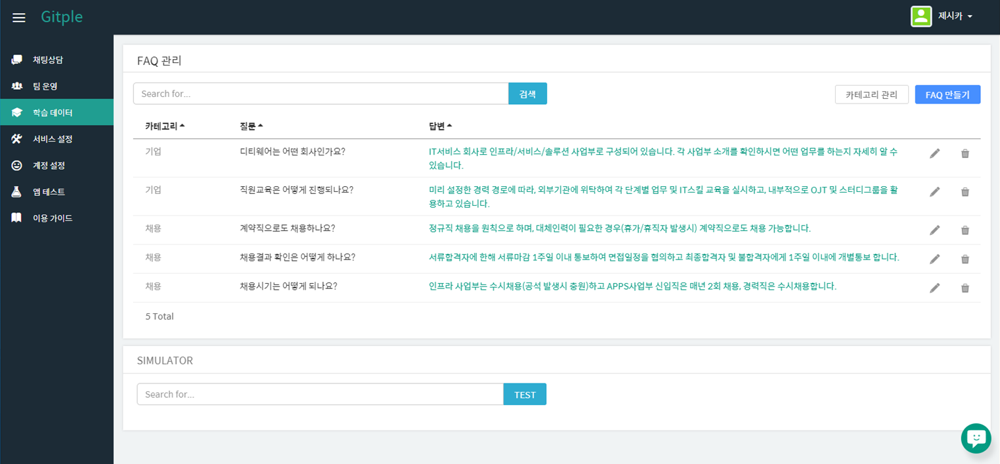
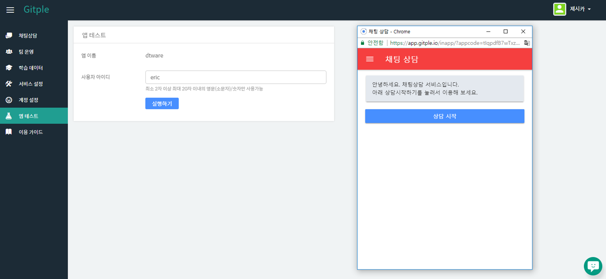
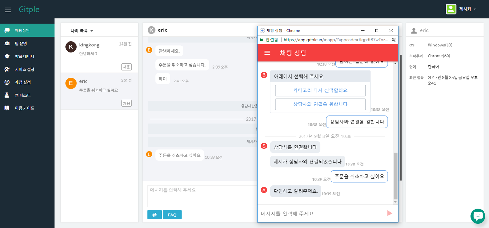
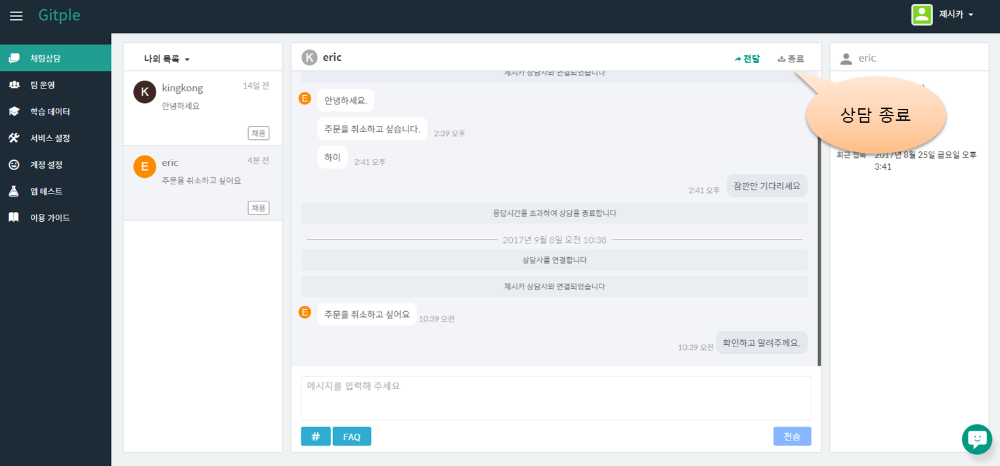

하이브리드 채팅상담 [깃플](https://gitple.io)

## 퀵스타트 가이드

### 1. 워크스페이스 접속
?> 발급받은 아이디와 비밀번호를 이용하여 **아래 링크**로 접속하여 로그인합니다. 계정이 없으시다면? [무료 가입](https://workspace.gitple.io/#/register)

#### https://workspace.gitple.io/

### 2. FAQ 관리
?> FAQ 카테고리를 만들고 이에맞게 질문과 답변을 입력합니다. FAQ는 실제 상담을 진행하면서 계속해서 수정하고 채워나가면 됩니다.

### 3. 채팅앱 테스트
?> 테스트 고객 아이디를 입력하고 실행합니다. 상담 시작버튼을 눌러, FAQ 안내가 제대로 되는지 확인합니다.

### 4. 상담사 연결
?> 채팅앱을 통해 입력된 문의내용은 채팅상담 메뉴에서 상담사가 답변할 수 있습니다.

### 5. 상담 종료
?> 상담이끝나면 상담 종료처리를 합니다.

 
[튜토리얼 페이지로 돌아가기](./tutorial.md)

---

© Gitple Inc. All Rights Reserved.
