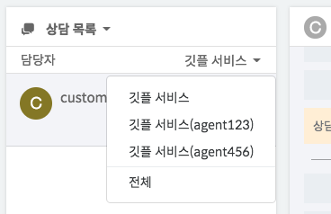
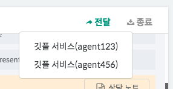

하이브리드 채팅상담 [깃플](https://gitple.io)

## 상담사간의 공동 이름 

공동으로 사용할 이름을 정하셨다면,

모든 상담사는 **프로필** 페이지에서 `이름`을 변경하면 해결됩니다.

?> 아래와 같이 여러 명의 상담사가 동일한 이름을 사용하더라도 **괄호안에 별도의 아이디를 명시**하기 때문에 내부적으로 구분이 가능합니다. 

| 상담 노트 확인시 |
|-------|
| |

| 상담 목록에서 선택시 | 상담사 변경시 |
|--------:---------:--------|
| | |

_상담 목록에서는 자신임을 쉽게 구분되도록 본인 아이디는 표시하지 않고 있습니다._

 
[튜토리얼 페이지로 돌아가기](./tutorial.md)

---

© Gitple Inc. All Rights Reserved.
