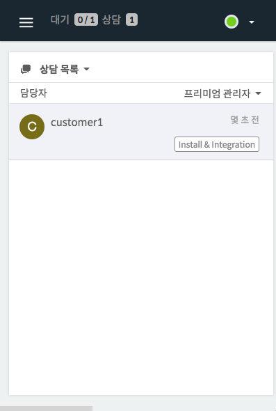
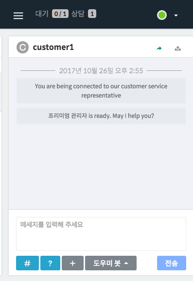

하이브리드 채팅상담 [깃플](https://gitple.io)

## 워크스페이스 보조 창

특별한 기능이 아닙니다. 하지만, **브라우저 창의 크기**를 줄여보십시오.
- 그럼, 아래와 같이 모바일 화면 크기에도 최적화 되어있음을 확인하실 수 있습니다.
- 이를 이용해 모니터의 한쪽에 놔두시고 업무를 보셔도 됩니다.

| 상담 목록 | 대화 방 |
|-----------:---------|
| | |

?> 상담 목록에서 방을 선택하면 **자동으로 대화방으로 화면이 이동**됩니다.

!> 메뉴가 사라지지 않는다구요? 워크스페이스의 왼쪽위에 있는 삼단 메뉴(3줄표시)를 눌러보세요.  

 
[튜토리얼 페이지로 돌아가기](./tutorial.md)

---

© Gitple Inc. All Rights Reserved.
