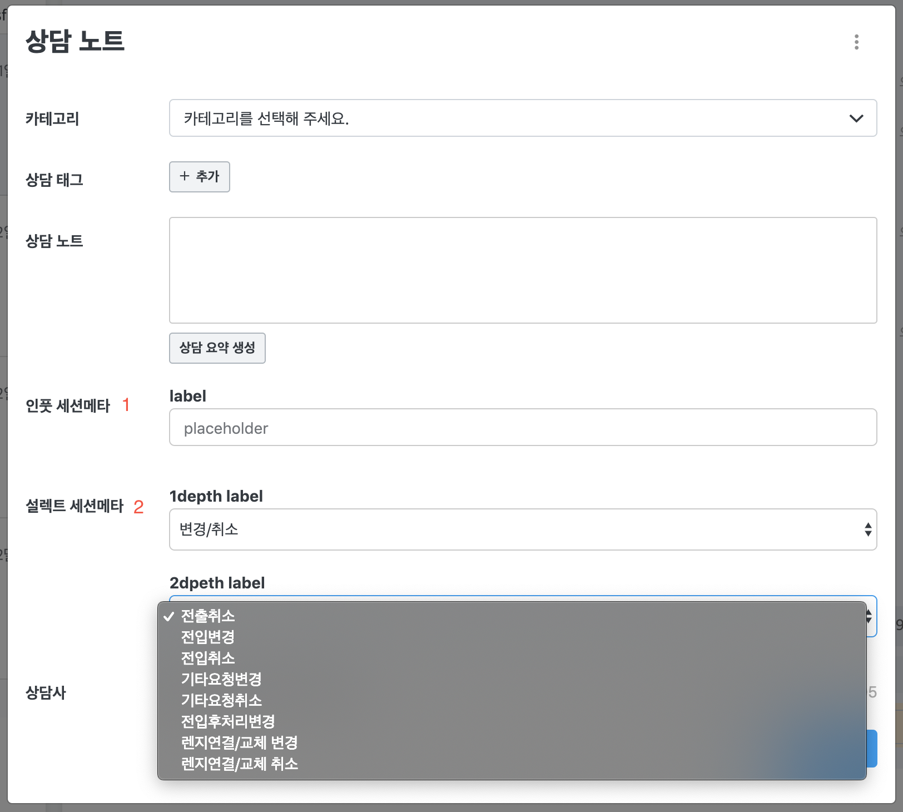

하이브리드 채팅상담 [깃플](https://gitple.io)

각 상담 내용에 대해 메타 정보를 기입해야할 때 사용합니다.  
기입하고 싶은 메타 정보가 있다면 **채팅문의**로 주시거나, **help@gitple.com**으로 메일 주시기 바랍니다.

##### 용어 설명
`상담 노트` : 상담 종료시에 뜨는 메모 기입란 화면   
`세션 메타` : 상담 종료시에 상담 노트에 추가로 기입할 데이터  
`UI Schema` : 메타 기입란이 어떤 형태로 표시될지에 대한 `JSON`형태의 Data   
`인풋 세션메타` : `input` tag 형태의 메타 기입란   
`설렉트 세션메타` : `select` tag 형태의 메타 기입란

##### UI Schema 예시
앱의 `UI Schema`는 별도의 문의를 통해서 생성이 가능합니다.   
`설렉트 세션메타`의 경우 특정 구글시트 형식을 사용하여 생성도 가능
```javascript
[
   {
      "type" : "input",
      "name" : "인풋 세션메타",
      "label" : "라벨1",
      "options" : {
         "placeholder" : "PlaceHolder"
      }
   },
   {
      "type" : "select",
      "name" : "설렉트 세션메타",

      // 1dpeth, 2depth label
      "label" : ["1depth","2dpeth"],
      "value" :[
         // 1depth data
         {
          "name": "변경/취소",
          "value": "1",
          "children": [
             // 2depth data
            {
              "name": "전출취소",
              "value": "2"
            }
            ...
          ]
        }
        ...
      ]
   }
]

```
##### 화면 예시



 - **인풋 세션메타** : `name`, `label`, `placeholder`,  으로 이루어져있고, 임의의 값을 넣을때 사용합니다.
 - **설렉트 세션메타** : 이미 정해진 값을 선택해서 넣을때 사용합니다. `name`, `1depth label`,`1depth data`, `2depth label`,`2depth data`로 이루어져있습니다.

?> 위에 명시된 태그들은 모두 커스터마이징이 가능합니다.

##### Open API & Event API

세션 메타의 경우 Open API와 Event API의 값이 아래의 예제와 같이 동일합니다.

**Event API** : session_state_close  
**Open API** : /api/v1/exports/sessions/**{session_id}**
```
{
   "session" : {
      "id" : {session_id}
       ...
      "tags":[],
      "meta":[
         {
            "type":"input",
            "name":"인풋 세션메타", /* 상단 화면 예제에서 2번의 글자와 동일 */
            "value": "input meta value"
            ]
         },
         {
            "type":"select",
            "name":"설렉트 세션메타", /* 상단 화면 예제에서 2번의 글자와 동일 */
            "value":[
               {
                  "name":"변경/취소", /* 1차 라벨에서 선택된 name */
                  "value":"1"  /* 1차 라벨에서 선택된 value */
               },
               {
                  "name":"전입변경", /* 2차 라벨에서 선택된 name */
                  "value":"2" /* 2차 라벨에서 선택된 value */
               }
            ]
         }
      ]
   }
}
```


- **type** : 해당 세션 메타에 대한 **타입**  `select`, `input`
- **name** : 해당 세션 메타에 대한 **정의**  **( Unique )**
- **value** : 해당 세션 메타에 대한 **리턴값**  &nbsp;**Array** 형태일 경우, 하위 값들 또한 name/value로 이루어집니다.

    - **String** : `input`, `textarea`등의 타입일 경우, **String** 형태로 값이 저장
    - **Array** : `select`타입 일경우, 저장된 값들은 **Array** 형태로 저장되며, 순서가 보장되는 성질을 이용해
    
    **Array[0]**은 **1차** 라벨에서 선택된 name/value.  
    **Array[1]**은 **2차** 라벨에서 선택된 name/value.   
    .
    .
    .

    **Array[n]**은 **n+1차** 라벨에서 선택된 name/value와 같이 **점차적으로** 값이 저장됨
    - **null** : 아무것도 값이 저장되지 않을경우 **null**형태로 저장됨


