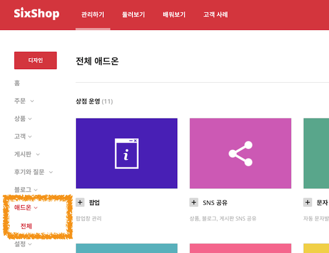
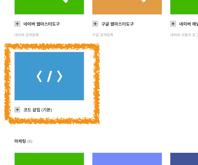
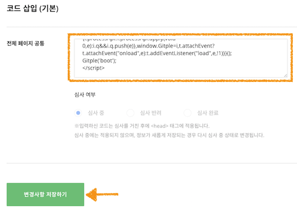

하이브리드 채팅상담 [깃플](https://gitple.io)

# 식스샵(Sixshop) 연동 가이드

식스샵 주소 - https://www.sixshop.com

#### 1. 관리자 페이지에 접속한 후, `디자인` > `애드온` 을 선택합니다.

#### 2. 아래와 같이 `코드 삽입` 애드온을 찾아서 선택합니다.

#### 3. HTML 스크립트 복사하기
* 깃플 워크스페이스 > "**설정 > 연동**" > "웹연동 스크립트 코드" 속성에서 HTML 코드 복사
* 아래 그림과 같이 입력창에 HTML 코드를 붙여넣음
  

!> 붙여넣기를 하신 후에, `변경사항 저장하기` 를 하시면 됩니다.

### 서비스 시작

현재 식스샵에서는 삽입되는 코드를 심사를 통해 반영하고 있기때문에, 심사가 완료된 후에 채팅상담 서비스를 이용할 수 있습니다.

(검수완료후) 홈페이지에 접속해보시면, (기본) 오른쪽 하단에 여러분 만의 채팅상담 서비스가 가능해진 것을 확인할 수 있습니다.

이상입니다.

아직 계정이 없으시다구요? [무료 회원 가입](https://workspace.gitple.io/#/register)

---

© Gitple Inc. All Rights Reserved.
