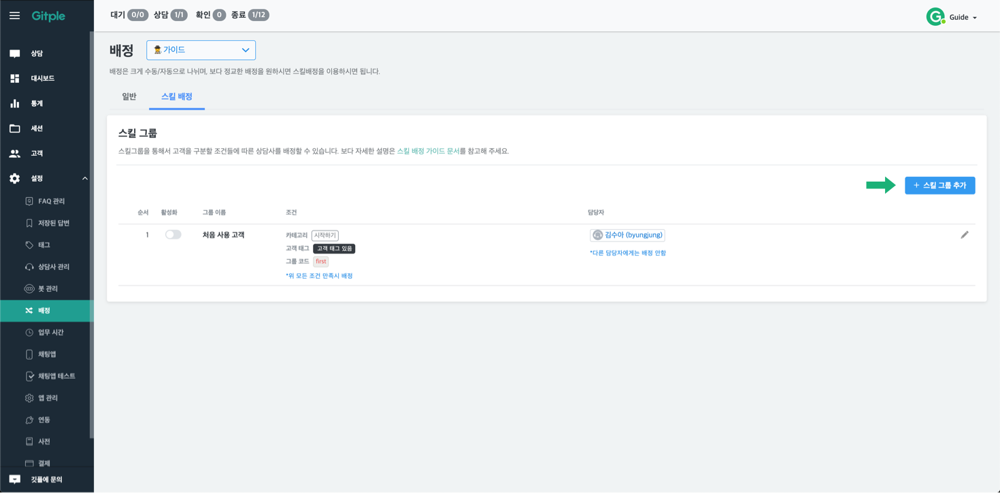
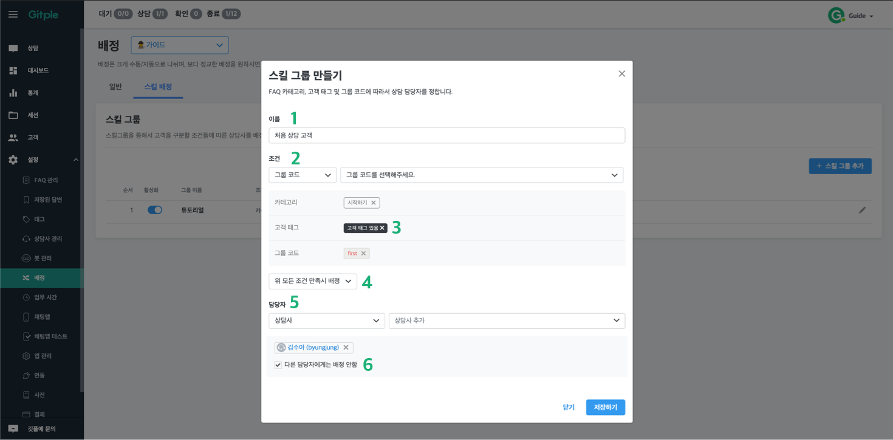
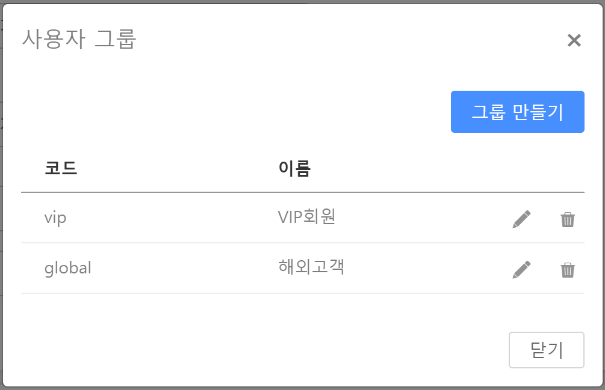

하이브리드 채팅상담 [깃플](https://gitple.io)

## 스킬 배정

고객 특성에 맞게, 원하는 상담사에게 배정시킬 수 있습니다.  

##### 용어 설명
`스킬 배정` : 각 스킬 그룹에 설정되어있는 조건을 통해, 자동으로 배정되는 기능을 통칭하여 이르는 말입니다.   
`스킬 그룹` : `스킬 배정`을 이루는 기본적인 요소로, `카테고리`, `고객 태그`, `그룹 코드`의 조건을 걸어,   
그에 알맞는 어떤 상담사에게 배정할지에 설정하는 그룹입니다.   

<br>

##### 스킬배정 설정 방법
      

`설정` -> `배정` -> `스킬 배정`이동 후, `스킬 그룹 추가` 버튼 클릭    
<br>
<br>

##### 설정 화면 ( 스킬 그룹 추가 화면 )
        


 - **이름** : 스킬 그룹의 이름을 지정합니다.  
 - **조건** : 상담사에게 배정할 조건 `카테고리` ,  `고객태그`, `그룹 코드`를 지정합니다.   
 각각의 조건에 <span style="background-color:black; border-radius:4px; padding:4px; color:white; font-size:11px; font-weight:bold">있음</span> , <span style="font-weight:bold;background-color:black; border-radius:4px; padding:4px; color:white; font-size:11px">없음</span>의 경우 해당조건이 <u>하나라도 존재할경우</u>, 해당조건이 값자체가 <u>존재 하지 않을경우</u>를 의미합니다.</span>   
  * **카테고리**: FAQ 관리에서 생성한 카테고리에 따른 처리가 필요한 경우
  * **고객 태그**: 태그 관리에서 생성한 고객 태그에 따른 처리가 필요할 경우
  * **그룹 코드**: 채팅앱 연동에 부여한 그룹 코드에 따른 처리가 필요한 경우
 - **AND/OR** : `조건 하나라도 만족시 배정`, `위 모든 조건 만족시 배정` 두가지가 있습니다
  * `조건 하나라도 만족시 배정` : 위의 조건들중 하나만 만족하여도 배정진행
  * `위 모든 조건 만족시 배정` : 위의 조건이 모두 만족시에만 배정진행
 - **담당자** : 스킬 그룹을 담당할 상담사(혹은 그룹)
 - **다른 담당자에게는 배정 안함** :    
 상담을 요청하는 고객이 해당 스킬 그룹에 포함되지 않는경우, 예외처리 배정방식을 통해,   
 **다른 스킬그룹**이나 **전체 상담사**에게 골고루 배정이 되는데, 예외처리 배정방식을 배제하는 기능입니다.   
 즉, 해당 스킬그룹에 상담을 요청하는 고객이 일치하는 경우, `다른 담당자에게 배정 안함` 옵션을 설정하면,   
 그 고객은 어떠한 경우에도 다른 담당자에게 배정되지 않습니다.


##### 기본적인 동작 방식
*  기본적으로 상담이 일어난 고객에 대해,   
위에서 설정한 해당 스킬그룹의 [**AND/OR**]에 따라, [**조건에 일치하는 고객**]에 따라서,  
 해당 스킬그룹에 배정된 상담사들 중, 온라인(상담) 상태의 상담사에게 연결됩니다.
  - 해당 스킬 그룹 조건에 일치하는 상담사가 모두 **숨김**처리이거나,   
  혹은 배정된 상담사가 한명도 없는경우에는 다음 순서의 스킬그룹 조건이 맞는지 검사합니다.
  - 상담사가 모두 **바쁨**인 경우엔, 다음 스킬그룹에 대한 체크를 하지 않고 그대로 대기합니다.
  - 모든 스킬 그룹에 해당사항이 없으면, 전체 상담사에게 골고루 분배합니다.
  
* **첫번째 부터 순서대로 스킬 그룹을 체크**하기 때문에, 순서 조정에 따라서 담당 상담사가 달라질 수 있습니다.

?> 멀티앱을 사용하는 경우, 각 앱별로 스킬배정을 설정할 수 있습니다.

---

### 사용 예시

* 10개의 FAQ 카테고리가 있는데, 3개/6개/1개 에 대해서 서로 다른 상담사가 처리할 경우
  1. 스킬 그룹을 3개(e.g. 회원일반, 상품문의, 기타) 생성
  2. 회원일반 스킬그룹에 카테고리 3개를 선택한 후에 상담사 지정
  3. 상품문의 스킬그룹에 카테고리 6개를 선택한 후에 상담사 지정
  4. 기타 스킬그룹에 카테고리 1개를 선택한 후에 상담사 지정

* 로그인 회원의 경우, 등급이 일반/우수/VIP로 되어있는데, 서로 다른 상담사가 처리할 경우
  1. 채팅앱 연동 코드에서 일반/우수/VIP에 대해서 각각 'basic','excellent','vip'를 `group` 속성에 추가
  2. 스킬 그룹을 3개(e.g. 일반회원, 우수회원, VIP고객) 생성
  3. 일반회원 스킬그룹의 코드 항목에 basic 추가 후에 상담사 지정
  4. 우수회원 스킬그룹의 코드 항목에 excellent 추가 후에 상담사 지정
  5. VIP고객 스킬그룹의 코드 항목에 vip 추가 후에 상담사 지정

  (홈페이지내 메인과 상품 페이지를 구별해서 상담사를 배정할 경우도 비슷하게 처리가능)
* 블랙컨슈머로 태그한 고객들에 대해서 별도 전담 조직에서 대응할 경우
  1. '블랙컨슈머' 란 이름으로 스킬 그룹 생성
  2. 해당 스킬그룹의 사용자태그 항목에 상담에 사용했던 사용자태그(e.g. 'black') 추가 후에 상담조직 지정

  (상담조직은 설정 > 상담사 관리의 "상담사 그룹 관리"에서 설정)  

---

### 조건 세부 설명

#### FAQ 카테고리

FAQ 안내 봇에서 상담사 연결직전에 선택한 카테고리를 이용하는 방식입니다. 따라서, FAQ 카테고리가 설정되어있고, FAQ 안내 봇을 사용함으로 되어있어야 합니다.

#### 고객 태그

고객들에게 부여한 태그를 이용하는 방식입니다. 따라서, "**고객 태그**"가 생성되어있고, 고객에게 해당 태그가 부여되어있어야 합니다.

#### 그룹 코드

채팅앱 연동시 아래와 같이 `group` 속성에 입력한 "**그룹 코드**"를 이용하는 방식입니다.

<!--     -->

* 로그인시 채팅앱을 구동할 경우

  ```javascript
  Gitple('boot', { // 채팅앱 구동과 로그인이 동시에
    id: '12345',
    group: 'vip'  // VIP회원 에 해당하는 코드
  });
  ```
* 채팅앱 구동 후 로그인할 경우
  ```javascript
  if (userLoggedin) { // 채팅앱 구동후, 로그인을 하면
    Gitple('update', {
      id: '12345', 
      group: 'vip' // VIP회원 에 해당하는 코드
    }
  }
  ```

위와 같이 채팅앱 연동코드를 작성 후에, 해당 고객이 상담사 연결 요청을 하게 되면, `VIP회원` 에 설정된 상담사(혹은 상담사 그룹)에 자동 배정되게 됩니다.

---

© Gitple Inc. All Rights Reserved.
