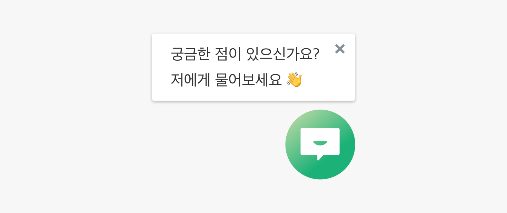
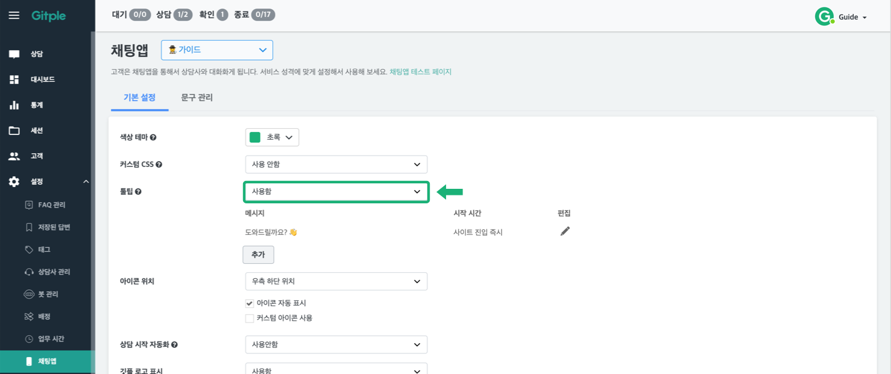
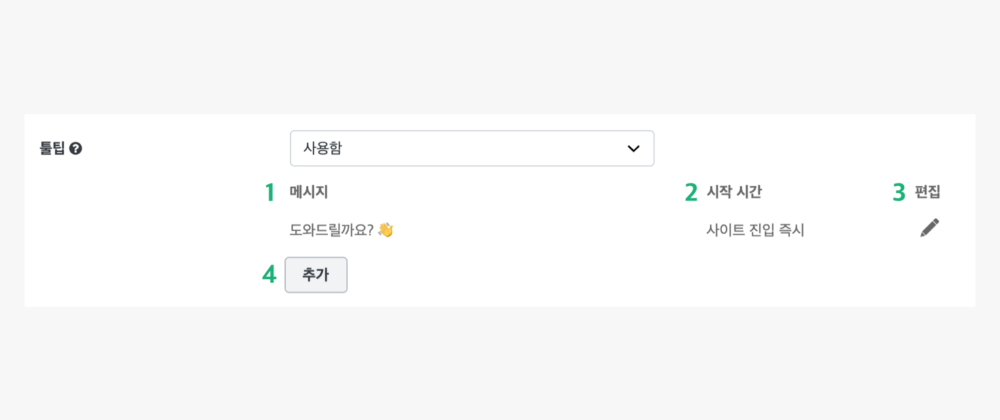
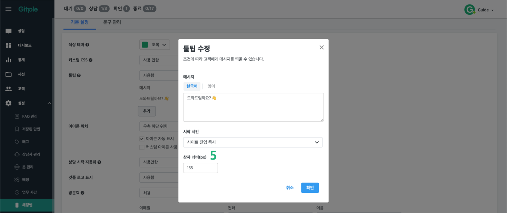
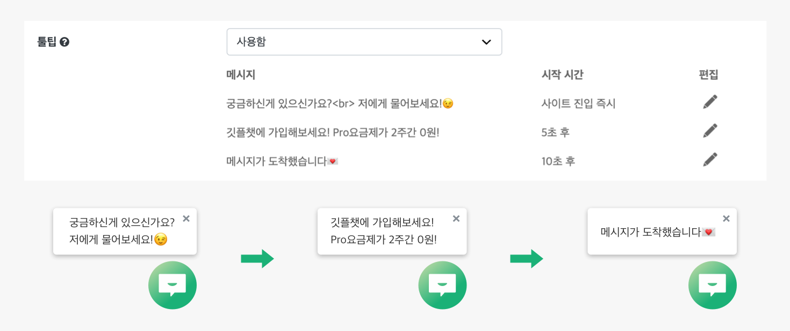
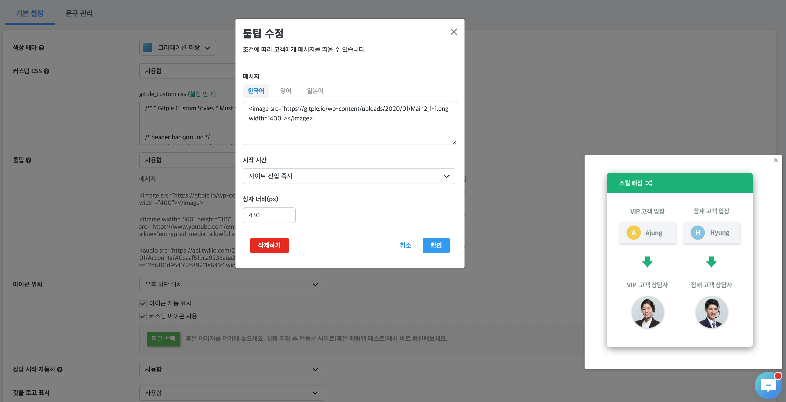
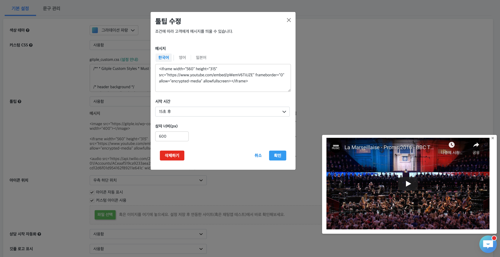
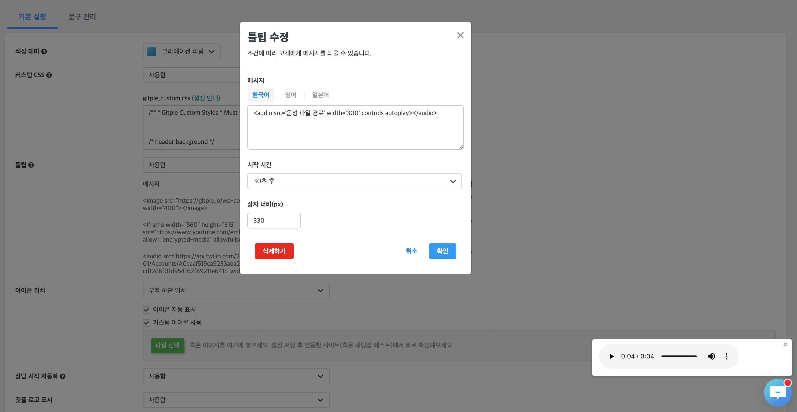

<style>
@media (max-width: 379px) {
    #tooltipShape {
        margin-left:0 !important;
        margin-top: 0 !important;
    }       
}

@media (max-width: 440px) {
    #tooltipShape {
        margin-left:0 !important;
    }
}
</style>

### 툴팁 

<span style="vertical-align:top">채팅앱 아이콘 상단의 메시지박스 설정할 수 있습니다</span>


##### 툴팁 설정 방법



1. `설정` -> `채팅앱` -> `툴팁`란에 `사용안함`에서 `사용함`으로 변경

###### 설정 화면




`메시지` : 채팅앱 아이콘 위에 표현될 툴팁 메시지 내용  
`시작 시간` : 사이트가 **로딩된 시점**에서, **몇 초후** 툴팁 메시지가 표시될지에 대한 설정 값  
`편집` : 해당 메시지에 대한 편집 모달 팝업  
`추가` : 새로운 메시지에 대한 추가 모달 팝업 - (최대 3개까지 추가 가능)  
`상자 너비(px)`**(모달 화면)** : 툴팁 너비(width) 설정

###### 툴팁 예시 시나리오



각 메시지 시작시간을 위 그림과 같이 설정하실 수 있습니다.

**예시 화면**
<video height="300" loop autoplay muted src="./assets/images/tooltip/tooltipExample.mp4"></video>

**이미지, 유튜브, 오디오 추가**

툴팁 안에 이미지, 유튜브 동영상, 오디오 트랙을 추가할 수 있습니다.
다만, 자동 재생은 지원하지 않습니다.
- 이미지
  ```javascript
  <image src="이미지 파일 경로" width="400" height="400"></image>
  ```
  
- 유튜브
  ```javascript
  <iframe width="560" height="315" src="https://www.youtube.com/embed/pWemV6TiUZE" frameborder="0" allow="encrypted-media" allowfullscreen></iframe>
  ```
  
- 오디오
  ```javascript
  <audio src='오디오 파일 경로' width='400' controls autoplay></audio>
  ```
  
