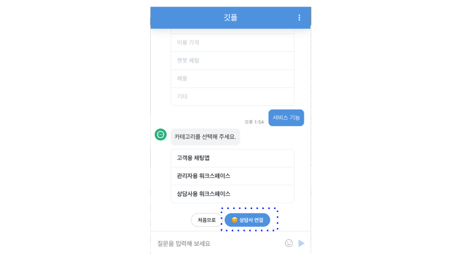

# 제품투어

깃플은 고객문의를 실시간 채팅으로 지원할 수 있는 채팅상담 서비스입니다. 아래 문서와 함께 고객과 실시간 채팅으로 대화하며 고객문의를 해결하고, 상담을 완료하는 방법을 테스트 해보세요.

> 독자 : 깃플 연동 전, 테스트를 통해 제품을 이해하고자 하는 고객.

### 목차

1. [회원가입](#_1-회원가입)
2. [상담하기](#_2-상담하기)
3. [상담설정](#_3-상담설정-상담사-그룹-서비스-설정)
4. [상담통계/관리](#_4-상담관리-상담-통계-및-관리)

## 1. 회원가입

회원가입 후 로그인을 해주세요.

## 2. 상담하기

> 채팅앱 연동 전, 테스트 메뉴를 통해 고객과 상담하는 방법을 소개합니다.

### 1) 상담 시작

1. **설정 > 채팅앱 테스트** 메뉴를 선택
2. 고객유형과 언어를 확인하신 후에 **실행** 버튼을 누릅니다. ([채팅앱 테스트 메뉴 설명](ws-inapp-test.md))

    

2. 새 창으로 채팅앱 테스트가 실행됩니다. 우측 아래의 **채팅앱 버튼**을 선택합니다.

    

3. **상담 시작** 버튼 선택하세요.

    

4. 기본으로 설정된 FAQ 안내 봇이 안내를 시작합니다. **카테고리를 선택**해보세요.

    

5. 카테고리 선택 후 상담사 연결 버튼이 활성화됩니다. **상담사 연결** 버튼을 선택합니다.

    

6. 상단 상태바의 대기를 선택하면 대기 목록에 상담 요청이 들어온 것을 확인할 수 있습니다.

    

    

7. 해당 상담을 **상담으로 변경** 선택합니다.

    

8. 상담이 시작됩니다.

    

### 2) 상담 진행/종료

1. 자세한 상담 진행은 아래 링크에서 확인해주세요.
2. [https://brunch.co.kr/@gitple/9](https://brunch.co.kr/@gitple/9)

## 3. 상담설정 (상담사 그룹, 서비스 설정)

1. **설정 > 상담사 관리** 메뉴에서 상담사를 초대하고, 상담사 그룹을 구성할 수 있습니다. ([상담사 관리 메뉴 설명](ws-settings-agents.md))

2. **설정 > 업무 시간** 메뉴에서 상담 업무 시간(일별 시간, 공휴일 등)을 설정할 수 있습니다. ([업무 시간 메뉴 설명](ws-settings-hours.md))

3. **설정 > 앱 관리** 메뉴에서 FAQ 안내 봇, 메시지 접수, 상담 안내 문구 관리 등을 할 수 있습니다. ([앱 관리 메뉴 설명](ws-settings-app.md))

## 4. 상담관리 (상담 통계 및 관리)

1. **통계** 기능을 활용해 상담의 흐름을 지속적으로 파악할 수 있습니다. 
2. **세션** 메뉴에서 지난 상담 내역을 확인할 수 있습니다.
3. **고객** 메뉴에서 상담을 진행한 고객의 데이터를 확인할 수 있습니다.

깃플의 주요 기능을 파악하셨다면, [연동하기](https://guide.gitple.io/#/sdk-list)를 알아보세요.

도움이 필요하시다면 언제든 깃플 채팅을 통해 문의주세요!
