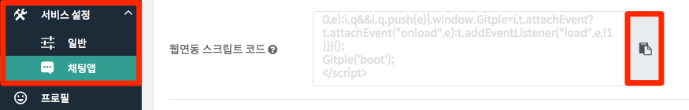
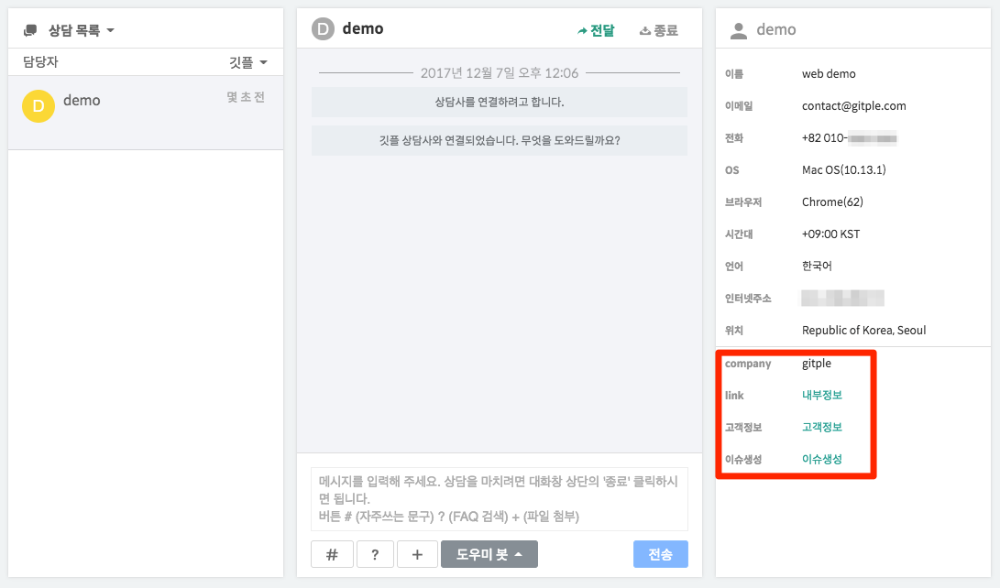

하이브리드 채팅상담 [깃플](https://gitple.io)

# 홈페이지 적용 가이드

깃플 채팅상담 서비스를 여러분의 홈페이지(웹사이트 혹은 웹앱)에 연동하는 절차를 설명합니다.

다음 HTML 코드에서 처음에 있는 `appCode` 부분만 채우시면 됩니다.

```javascript
<script>

window.GitpleConfig = {
  appCode: 'xxxxxxxxxx' // 워크스페이스 `설정 > 연동` 메뉴에서 앱코드 복사
};

!function(){function e(){function e(){var e=t.contentDocument,a=e.createElement("script");a.type="text/javascript",a.async=!0,a.src=window[n]&&window[n].url?window[n].url+"/inapp-web/gitple-loader.js":"https://app.gitple.io/inapp-web/gitple-loader.js",a.charset="UTF-8",e.head&&e.head.appendChild(a)}var t=document.getElementById(a);t||((t=document.createElement("iframe")).id=a,t.style.display="none",t.style.width="0",t.style.height="0",t.addEventListener?t.addEventListener("load",e,!1):t.attachEvent?t.attachEvent("onload",e):t.onload=e,document.body.appendChild(t))}var t=window,n="GitpleConfig",a="gitple-loader-frame";if(!window.Gitple){document;var i=function(){i.ex&&i.ex(arguments)};i.q=[],i.ex=function(e){i.processApi?i.processApi.apply(void 0,e):i.q&&i.q.push(e)},window.Gitple=i,t.attachEvent?t.attachEvent("onload",e):t.addEventListener("load",e,!1)}}();

Gitple('boot'); // 로그인 사용자라면 아래 추가 정보 부분을 확인

</script>
```

#### 위의 코드 전체(`<script> </script>` 까지 포함)를 복사해서 사용할 웹 페이지의 `</head>` 바로 앞에 붙여넣기 하시면 됩니다. 끝!

?>  **위 HTML 코드를 자동 생성하기** - [워크스페이스](https://workspace.gitple.io)에서 "**설정 > 연동**" > "웹연동 스크립트 코드" 속성의 코드를 위 HTML 코드를 복사하여 붙여넣기


아직 계정이 없으시다구요? [무료 회원 가입](https://workspace.gitple.io/#/register)

---

### 추가 정보

#### 로그인 사용자 처리

로그인 상담고객 정보를 연동하기 위해, 필요한 고유정보를 입력합니다.

"웹연동 스크립트 코드" 속성에 있는 스크립트 끝부분의 `Gitple('boot')';` 대신에 아래와 같이 작성하시면 됩니다.

```javascript
Gitple('boot', {
  id: '12345', // [필수] 상담고객 식별 ID
  name: '홍길동',
  email: 'gildong1@gmail.com',
  phone: '010-1234-1234',
  meta: {      // [선택] 아래 세부 정보 참고
    'Company': 'Gitple',
    'Link': '<a href="https://gitple.io/" target="_blank">내부정보</a>',
    '고객정보': '<a href="https://myService/api/customer?id=12345" target="_blank">고객정보</a>',
    '이슈생성': '<a href="https://github.com/gitple/cs/issues/new?title=이슈제목&body=고객이슈내용" target="_blank">이슈생성</a>'
  }
});
```


* 참고 - 각 항목별 세부 정보

| 항목 | 타입            | 세부 설명|
| :------- |:---------------:| :----------------------------|
| id       | String(required)  | 상담고객 구분 ID: 서비스내 상담고객의 고유값. 로그인아이디, 이메일주소등도 가능하지만 유추할 수 없는 UUID, 숫자 등을 권장함. (숫자, 알파벳 소문자, '.', '@'으로 구성, 처음과 마지막은 특수문자를 사용할 수 없음, 최대 50자까지 허용) |
| name     | String(option)  | 상담고객 이름                    |
| email    | String(option)  | 상담고객 이메일                   |
| phone    | String(option)  | 상담고객 전화번호                 |
| meta     | Object(option)  | 기본 필드 이외에 필요한 추가 정보를 상담 화면에서 표시해야 할 경우 사용하는 필드. `{'company':'gitple', 'city': 'seoul'}` |


* meta 정보에 회원정보와 관련 URL 링크 정보를 연동하시면, 워크스페이스에서 더욱 편리하게 상담을 진행하실 수 있습니다.



### 싱글 페이지 앱(Single Page App)

#### 로그인 하지 않은 사용자에서 로그인 사용자로 변경

사용자 고유 정보와 함께 `Gitple('update', '사용자 정보')'` API를 실행하면 깃플 상담이 로그인 사용자로 업데이트 됩니다.

```javascript
if (userLoggedin) {
  Gitple('update', {
    id: '12345', // [필수] 상담고객 식별 ID
    name: '홍길동',
    email: 'gildong1@gmail.com',
    phone: '010-1234-1234',
    meta: {                       // [선택] 아래 세부 정보 참고
      'Company': 'Gitple',
      'Link': '<a href="https://gitple.io/" target="_blank">내부정보</a>',
      '고객정보': '<a href="https://myService/api/customer?id=12345" target="_blank">고객정보</a>',
      '이슈생성': '<a href="https://github.com/gitple/cs/issues/new?title=이슈제목&body=고객이슈내용" target="_blank">이슈생성</a>'
    }
  });
}
```

#### 사용자 로그아웃 처리

사용자가 로그아웃할 경우는 `Gitple('update')'` API를 실행하여서 사용자 정보를 초기화 할 수 있습니다.

```javascript
if (userLogout) {
  // 사용자가 로그아웃시에 방문자로 상담 서비스 계속 진행할 경우
  Gitple('update');
}
```

만약 로그아웃시에 깃플 상담을 완전히 종료할 경우는 `Gitple('shutdown')'`을 실행하시면 됩니다.

```javascript
if (userLogout) {
  // 사용자가 로그아웃시에 상담 서비스를 종료할 경우
  Gitple('shutdown');
}
```

!> 로그아웃시에는 반드시 사용자 정보를 초기화하거나 종료의 처리가 필요합니다.


### 상담 화면 설정

#### 사용자 언어 설정

?> 설정 가능한 언어는 워크스페이스의 "**설정 > 채팅앱**" 에서 "채팅앱 지원 언어"에 설정된 언어로만 변경됩니다.

- 초기 설정에서 언어 설정하기

```javascript
window.GitpleConfig = {
  appCode: 'xxxxxxxxxx',
  userLang: 'en'
};
```

- 언어 설정 화면에서 변경할 경우 설정하기

```javascript
function changedLanguage(lang) {
  window.GitpleConfig['userLang'] = lang;
  Gitple('update');   // 변경 사항 적용하기
}
```

#### 파일첨부 기능 끄기

?> 파일첨부는 채팅앱에서 파일을 첨부할 수 있는 기능으로 기본 설정은 사용으로 되어있습니다.

- 초기 설정에서 파일첨부 기능 끄기

```javascript
window.GitpleConfig = {
  appCode: 'xxxxxxxxxx',
  showFileUpload: false
};
```


#### 쿠키 사용여부 조정

?> 방문객 로그인 정보 유지 여부 등을 위해서 쿠키는 기본 설정은 `사용`으로 되어있습니다.

- 초기 설정에서 쿠키 사용여부 끄기

```javascript
window.GitpleConfig = {
  appCode: 'xxxxxxxxxx',
  enableCookie: false
};
```

---

### GitpleConfig 속성 테이블

`window.GitpleConfig` 에서 설정할수 있는 속성들에 대한 설명입니다.

| 속성 | 사용할 수 있는 값들 | 설명 |
| :----------- |:--------------------- | :----------------------------|
| **appCode** | `'Your App Code'`  | 깃플 연동 앱 코드 |
| **userLang** | `'ko'`, `'en'`, `'ja'`, `'zh'`, `'vi'` | 한국어/영어/일본어/중국어/베트남어 (없을 경우 시스템 언어 자동 반영) |
| **showFileUpload** | `true`, `false`  | 파일 첨부 기능 사용 여부. 기본 값 `true` (유료 요금제만 지원)|
| **enableCookie** | `true`, `false`  | 쿠키 사용 여부. 기본 값 `true` |
| **screenMode** | `'auto'`, `'normal'`, `'full'`  | 채팅앱 화면 모드로 PC에서도 풀스크린을 원할때 강제로 `'full'` 세팅 가능. 기본 값 `'auto'` (= PC일 경우 normal, 모바일 경우 full) |

---

[inapp-web-api](inapp-web-api.md ':include')

---

© Gitple Inc. All Rights Reserved.
