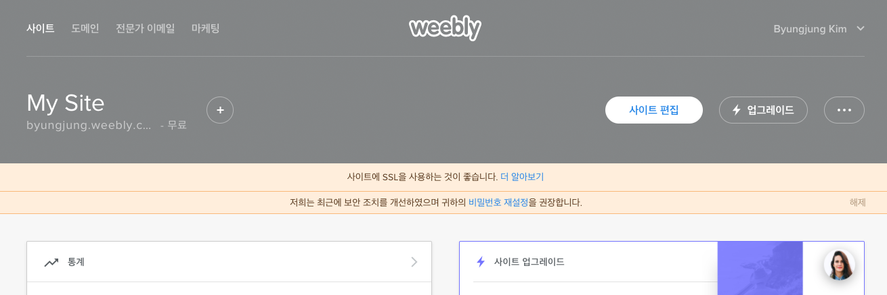
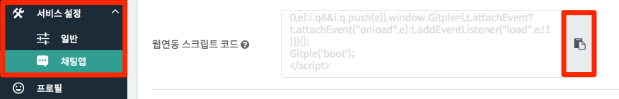
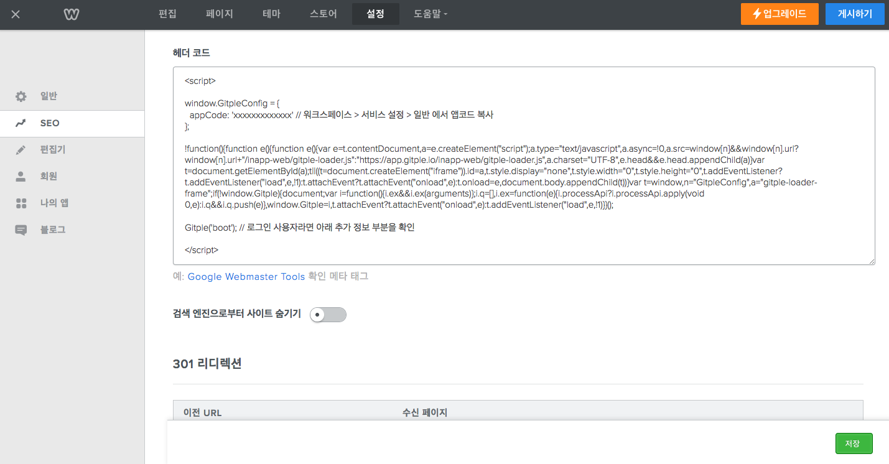
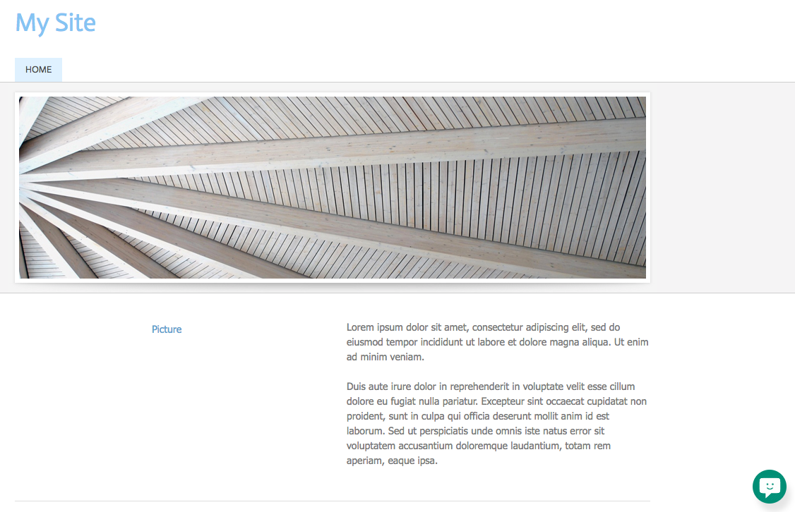

하이브리드 채팅상담 [깃플](https://gitple.io)

# 위블리(Weebly) 연동 가이드

위블리 주소 - https://www.weebly.com/

#### 1. 사이트의 오른쪽에 있는 `사이트 편집` 메뉴를 눌러서 이동합니다.

#### 2. HTML 스크립트 복사하기

* 깃플 워크스페이스 > "**설정 > 연동**" > "웹연동 스크립트 코드" 속성에서 HTML 코드 복사
  
* 위블리 사이트의 "**설정**" 탭의 "**SEO**" 메뉴에서 `헤더 코드` 부분에 깃플 워크스페이스에서 복사
  
* 입력 후에 **저장**버튼을 누르시고, 오른쪽 상단에 있는 **게시하기** 선택

### 서비스 시작

홈페이지에 접속해보시면, (기본) 오른쪽 하단에 여러분 만의 채팅상담 서비스가 가능해진 것을 확인할 수 있습니다.

이상입니다.

아직 계정이 없으시다구요? [무료 회원 가입](https://workspace.gitple.io/#/register)

---

© Gitple Inc. All Rights Reserved.
