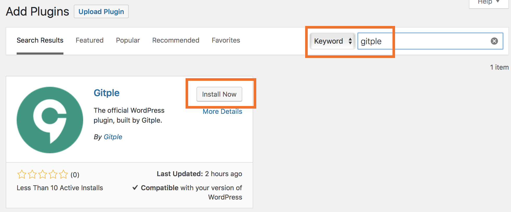
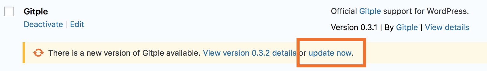
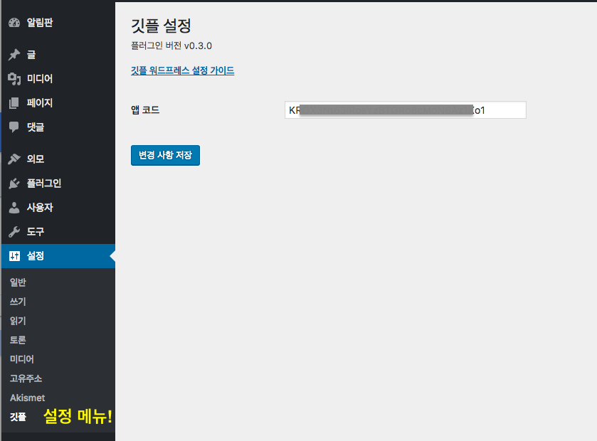
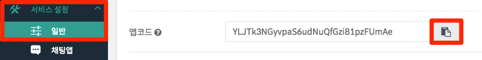

하이브리드 채팅상담 [깃플](https://gitple.io)

# 깃플 워드프레스 연동 가이드

본 가이드는 워드프레스에서 깃플 채팅상담 서비스를 연동하는 가이드 문서입니다.

### 호환성
  - PHP 5.6 버전 이상을 권장합니다.

### 설치

  - **먼저 플러그인을 검색해서 설치합니다.** `gitple` 로 검색 후, `설치(install)` 및 `활성화(activate)`를 해줍니다.

    

    - 기존 이용자 포함 이후에는 업데이트만 하시면 됩니다.

      

  - 플러그인이 활성화되면 관라지 메뉴의 "**설정(Setting)**" 에 `깃플(Gitple)` 메뉴가 표시됨을 확인하고 실행합니다.

    

    * `앱코드`: [워크스페이스](https://workspace.gitple.io)에 로그인 후에 "**설정 > 연동**" 메뉴에서 `앱코드` 부분의 코드를 복사하여 입력합니다
      

### 서비스 시작

홈페이지에 접속해보시면, 오른쪽 하단에 깃플 런쳐메뉴를 통해서 여러분 만의 채팅상담 서비스가 가능해진 것을 확인할 수 있습니다.

!> 이 플러그인은 사용자 데이타가 포함된 `Javascript 소스`를 웹페이지 삽입합니다. 그러므로, 일부 캐싱 솔루션에서는 전체 페이지를 캐싱하므로 이 플러그인과 함께 사용할 경우 대화가 잘못된 사용자에게 전달될 수도 있습니다.

아직 계정이 없으시다구요? [무료 회원 가입](https://workspace.gitple.io/#/register)

---

© Gitple Inc. All Rights Reserved.
