# 상담

#### 룸 리스트

상담을 시작하면, 고객별로 룸이 생성됩니다.
룸은 `대기`, `상담`, `확인`,`종료` 으로 구분됩니다.

?> **팁!** 상태바의 각 부분을 `클릭`하시면 아래 대화목록으로 바로 이동할 수 있습니다.

  

  * `대기`/`상담`/`종료`의 2/4 표시의 경우, **자신**에 배정된 것은 2개 / **전체** 상담 건수가  4개라는 의미입니다.
  * `종료`의 경우 **오늘 처리된 숫자**를 표시합니다. 

#### 상담
  - 자신에 배정된 고객 목록을 보여줍니다.
  - 다른 상담사의 목록을 볼 수도 있습니다.

    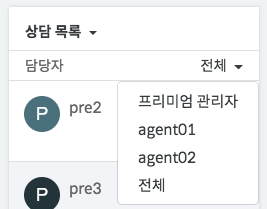

    - 담당자 필터에는 상담사 리스트 외에도 `봇` 혹은 `상담사 그룹`이 표시됩니다.

  - 상담사가 실수로 메시지를 잘못 입력한 경우에 대해서 삭제 기능을 제공합니다. (Pro 요금제)
    - 전송된 메시지 마우스를 호버하면, 아래와 같이 삭제할 수 있는 메뉴가 나옵니다.
      - 5분 이내의 메시지만 가능하며, 고객에게도 마찬가지로 삭제됨으로 표시됩니다.
      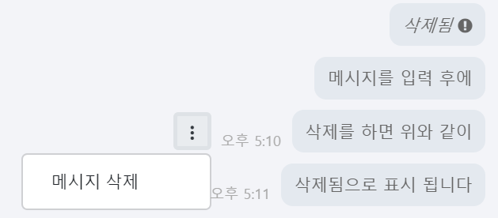

  - 상담사이 입력 편의를 위해서, 메시지 포맷 (`굵게` / `이탤릭` / `취소선` / `코드`)을 지원합니다.
    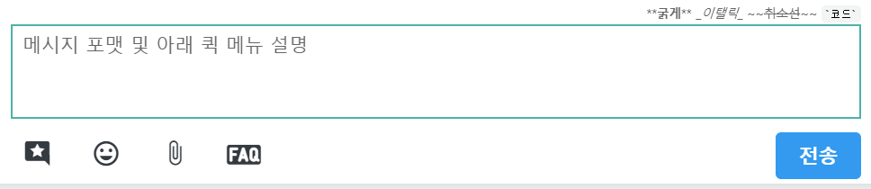
    - 사용방법은 다음과 같습니다
      - `굵게` : \*\*내용\*\*
      - `이탤릭` : \_내용\_
      - `취소선` : \~\~내용\~\~
      - `코드` : \`내용\`
      
  - 위 그림에서 보는 바와 같이 입력 창 아래에는 `저장된 답변` / `이모티콘` / `파일첨부` / `FAQ` 검색 메뉴를 제공합니다. 
  - 상담시, 대화창 오른 쪽의 `사용자 정보`를 통해서, 상담 고객의 정보를 아래와 같이 확인할 수 있습니다.
    - 이름, 전화번호, 이메일에 대해서는 수정을 할 수 있습니다.
      - 특히, 방문객의 경우 채팅내용에서 정보를 알게된 경우 업데이트하면 유용합니다.
    - 사용자에 태그를 바로 추가할 수 있습니다.
      - 태깅된 정보는 고객리스트, 통계, 상담사 배정 등에 이용됩니다.

    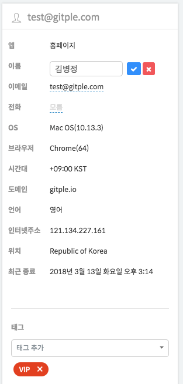

  - 상담 중 노트를 입력할 수 있으며, 해당 노트는 종료시 상담노트에도 표시됩니다.
    - 고정하기를 체크해두시면, 상담 중에도 계속 확인 및 업데이트 가능합니다.

    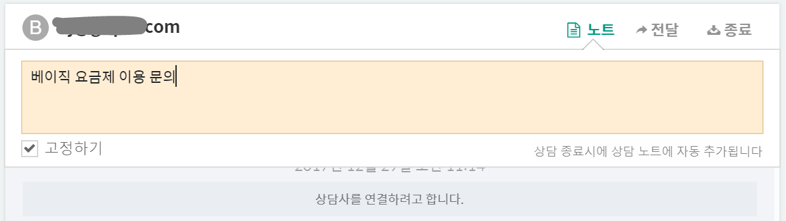

  - 상담을 완료하려면, 대화창의 우측 상단에 있는 `종료`를 하면 됩니다.
    - 종료시 상담 노트를 작성할 수 있습니다. 바로 `저장하기` 눌러도 종료가 됩니다.
      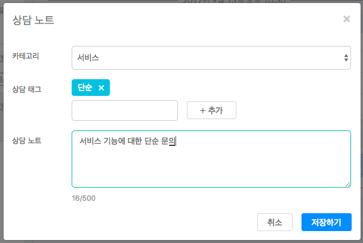
    - 상담 요약 정보를 자동으로 불러올 수 있습니다. 아래와 같이 **상담 요약 생성** 버튼을 눌러보세요.
      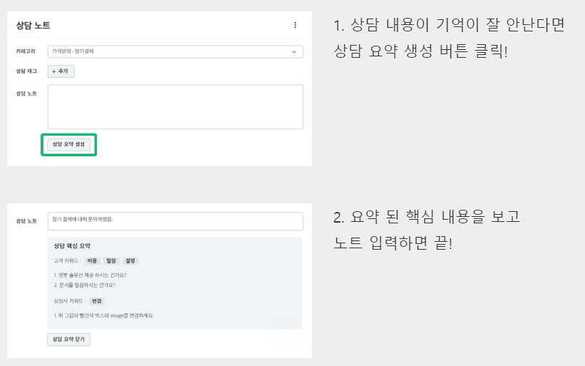
    - 나중에 다시 아래와 같이 대화창에서 `상담 노트`를 업데이트 할 수 있습니다.
      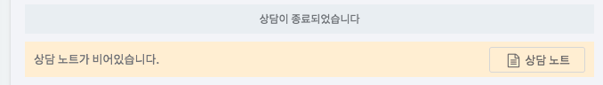
  
  - 고객과의 현재 상담을 다른 상담사에 전달할 경우에 `전달` 기능을 사용하면 됩니다.
    - 대화창 헤더의 `전달` 메뉴를 통해서 다른 상담사(혹은 상담사 그룹)를 지정하면 됩니다.
      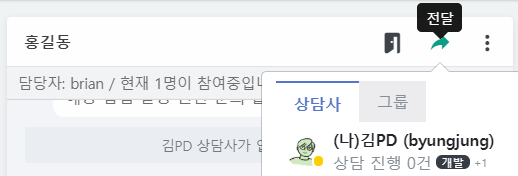

  - 고객과 대화중인 상담사외에 추가로 상담사가 개입해서 대화를 원할 경우 `입장` 기능을 사용하면 됩니다.
    - 대화창 헤더의 `입장` 메뉴를 통해서 다른 상담사가 해당 대화에 참여할 수도 있습니다.
      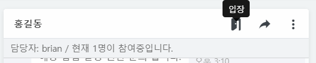

  - 문의 고객이 상담사가 이해할 수 없는 언어로 대화를 할 경우 `번역` 기능을 사용하면 됩니다.
    - 대화창 헤더의 더보기 메뉴의 `상담 번역` 기능을 통해서 원본 메시지와 함께 번역된 메시지를 자동으로 보낼수 있게 됩니다.
      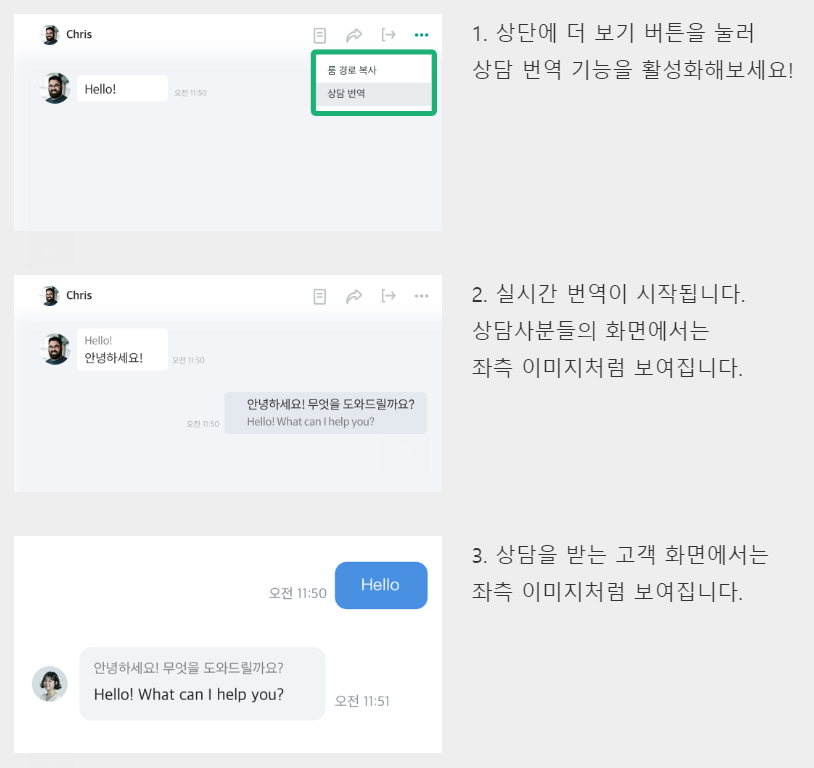

#### 대기
  - 상담사에 배정되기 전의 대기하는 고객의 목록을 보여줍니다.
  - 대화창의 우측 상단에 있는 `상담으로 변경`을 눌러서, 자신의 상담 목록으로 이동시킬 수 있습니다.
    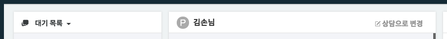
    * 상담사 스스로가 명시적으로 `상담으로 변경`한 경우는 무조건 상담 목록으로 이동됩니다.
    * 다른 상담사로 전달하는 경우는 배정 방법에 따라서 동작합니다.
  - 필터 중 `나`를 선택하시면, 본인에게만 배정될 대기열 고객만 표시됩니다. (재선택시 전체로 변경)

#### 종료
  - 종료 처리된 고객 목록을 보여줍니다.
    - **오늘자 기준**으로 처리된 건 수에 대한 항목을 기본으로 표시합니다.
  - 상담 목록과 마찬가지로 다른 상담사가 처리한 목록을 볼 수도 있습니다.
    - 상담목록과 달리 전체(모든 상담사)가 처리한 것을 기본으로 보여줍니다.

#### 확인
  - 메시지 접수 받은 고객 목록으로 상담 목록과 마찬가지로 진행하면 됩니다.
    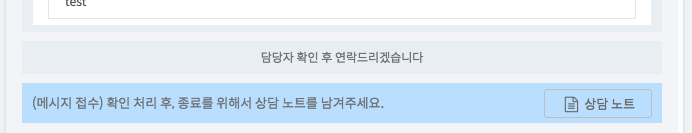
    - `상담노트`를 한번이라도 열어서 저장하게 되면, 확인 목록에서 보이지 않게 됩니다. (종료 목록으로 이동)
    - 추가로 특정 메타 정보를 `상담노트`에 기입하고 싶을경우, 해당 [링크](session-meta)를 참고하시어 gitple에 문의 바랍니다.
---

© Gitple Inc. All Rights Reserved.
