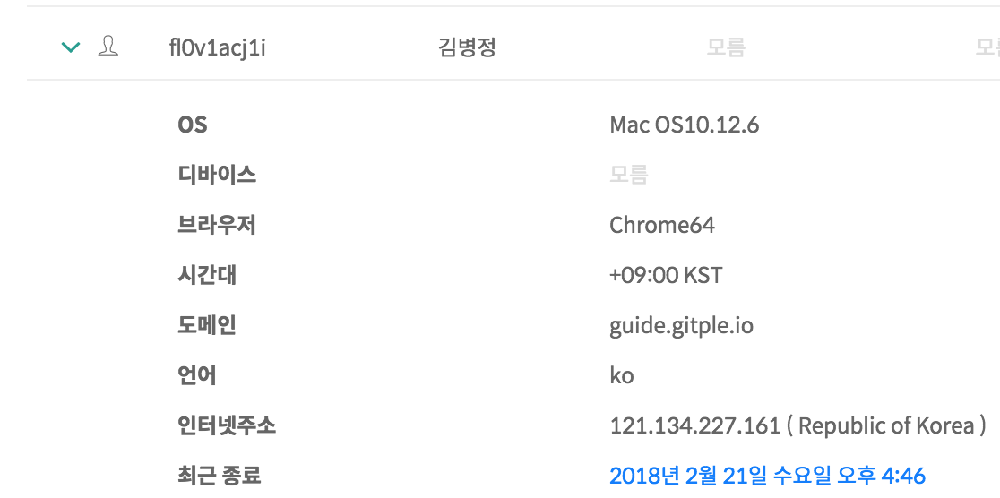

# 고객

상담 고객들의 목록을 보여줍니다.
  

  - 상담고객: 상담을 한번이라도 받은 고객
    - 비상담고객: 상담을 한번도 받지 않은 고객(정보 입력 혹은 로그인만 시도함)
  - 이름, 이메일, ID 에 대해서 검색을 할 수 있습니다.
  - 태깅한 사용자만 별도로 확인할 수 있습니다.
  - 테이블의 정보를 CSV 파일로 추출할 수 있습니다.

  - 마지막 상담시각(마지막 세션의 시작 시점)을 기준으로 정렬이 되어있습니다.
  - 아이디는 연동한 서비스 내에서 관리하는 고유한 ID 입니다. (참고: [로그인 상담고객 정보](http://guide.gitple.io/#/web-sdk?id=로그인-사용자-처리))
    - 방문객(로그인하지 않은 고객)의 경우엔 이메일주소가 아이디로 표시됩니다.
  - 그 외에 이름, 이메일, 전화, OS, 디바이스, 브라우저, 언어, 시간대 등이 테이블로 표시됩니다.
    - 모니터의 해상도가 낮을 경우 가로로 스크롤해서 모든 정보를 확인하실 수 있습니다.
      - 아이디와 이름은 고정되어서, 해당 정보가 누구의 것인지 쉽게 파악할 수 있습니다.

  - 해당 고객의 대화를 바로 확인할 수 있는 링크(아래 파란색 부분)를 제공하고 있습니다.
    

