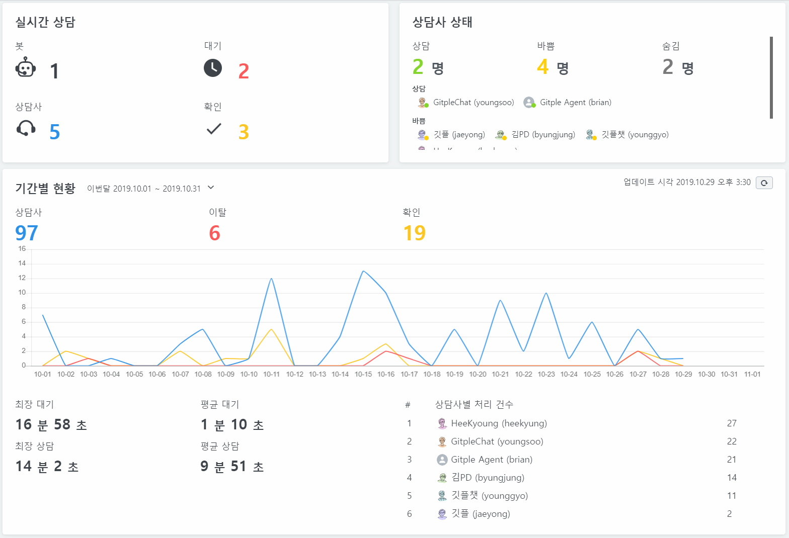

# 대시보드

실시간 상담 현황을 한 눈에 파악할 수 있습니다.
고객이 얼마나 이탈했는지, 누가 상담을 많이 했는지 등 관리자가 필요로 하는 부분을 보여줍니다.

### 실시간 상담

실시간으로 고객 응대 현황을 보여줍니다.

* 봇 - 봇과 대화중인 고객의 수
* 대기 - 상담사 연결 요청 한 대기 고객의 수
* 상담사 - 현재 상담사와 대화중인 고객의 수
* 확인 - 메시지 접수를 남긴 고객의 수

### 상담사 상태

상담사 상태에 따른 현재 상담사 수와 리스트를 실시간으로 보여줍니다.

### 기간별 현황

오늘/이번주/이번달, 어제/지난주/지난달의 기간에 따른 상담 현황을 보여줍니다.
업데이트 시각 옆의 업데이트 버튼을 눌러서 최신 정보를 확인할 수 있습니다.

* 상담사 - 상담사가 고객과 상담한 건수
* 이탈 - 대기중의 고객이 상담사 연결을 기다리지 않고 종료한 건수
* 확인 - 메시지 접수 건수
* 최장 대기 - 가장 오래 대기한 고객의 시간
* 평균 대기 - 고객들의 전체 평균 대기 시간
* 최장 상담 - 가장 오래 진행된 고객의 상담 시간
* 평균 상담 - 고객들의 전체 평균 상담 시간
* 상담사별 처리 건수 - 가장 많이 처리한 상담사부터 건수와 평균 상담시간을 표시

---

© Gitple Inc. All Rights Reserved.
