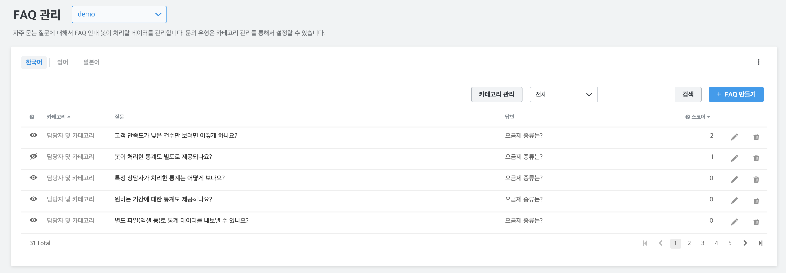
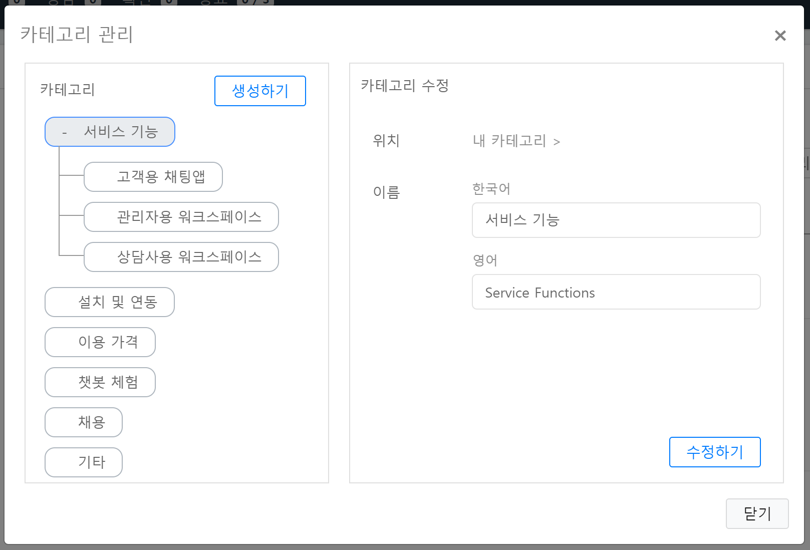
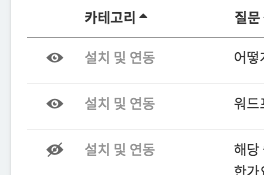
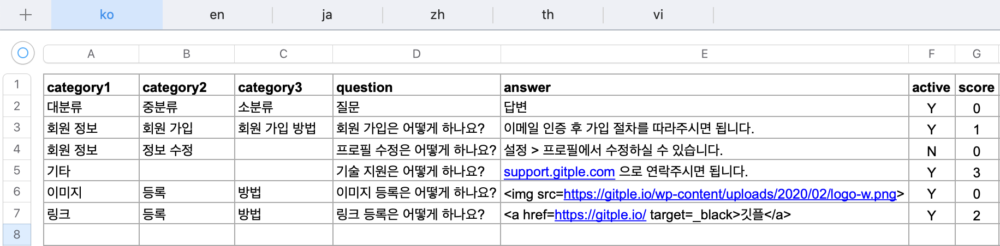
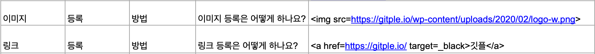
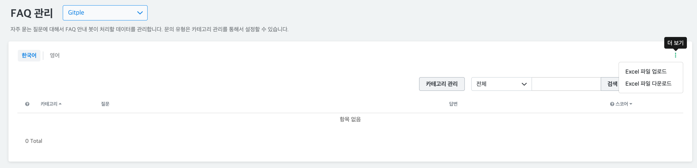
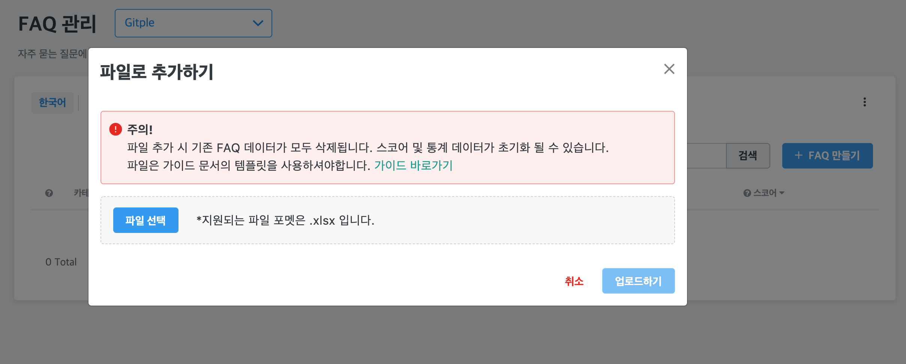
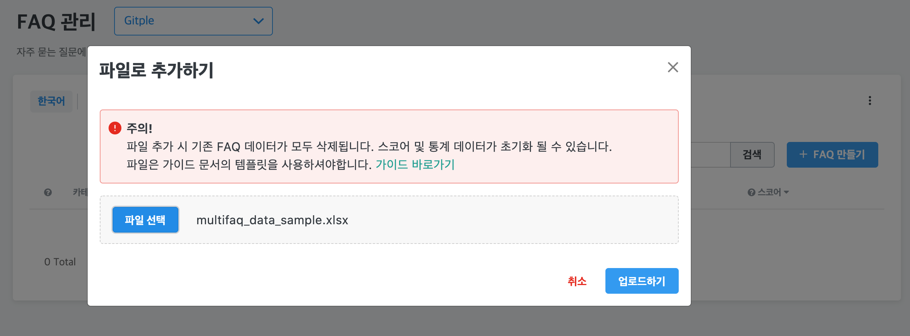

## FAQ 관리 {docsify-ignore}

> 상담 데이터가 쌓여갈수록 보다 정확한 고객상담이 가능합니다.

### 1. 카테고리 관리

FAQ 분류를 위해 카테고리 설정

* 상담고객에게 보여지는 카테고리 순서를 아래와 같이 변경할 수 있습니다.

  

  - 멀티레벨 카테고리는 **Pro 요금제**에서 사용 가능합니다.
  - `생성하기`를 통해서 새로운 카테고리를 만들 수 있습니다.
  - `위치`는 해당 카테고리가 어디에 속할지 설정하는 것이며, `내 카테고리`는 최상위입니다.
  - 변경/삭제가 필요한 카테고리를 선택하시면, `수정하기` 메뉴를 누르시고 작업가능합니다.

### 2. FAQ 생성

카테고리 별 질의응답 리스트들을 추가

### 3. FAQ 항목

생성한 각 FAQ 항목 표시

### 4. FAQ 수정

카테고리, 질문, 답변에 대한 수정

* 해당 FAQ를 사용할지 결정할 수 있습니다. 즉, 미리 만들어 두거나, 사용을 잠시 중지 할 수 있습니다.

  

  - 활성화 여부는 FAQ 리스트의 맨 앞에 아이콘으로도 쉽게 구별이 가능합니다. (아래 그림의 3번째는 비활성화)

    

?> 상담사 연결 전에 선택한 FAQ 카테고리 및 질문항목에 대해서, 상담사 화면에서 확인할 수 있기에 보다 효율적인 고객응대가 가능합니다.

### 5. FAQ 업로드

Excel 파일로 대량의 FAQ를 등록할 수 있습니다. 언어별 등록이 가능합니다.

다중 언어 등록 시 `앱 관리 > 채팅앱 지원 언어`에 등록할 언어를 추가하셔야 합니다.

- **주의!!!**

  기존 등록된 FAQ는 `초기화`되며, 업로드하는 Excel 파일의 내용으로 등록됩니다.
  등록 데이터에 따라 스코어 / 통계 정보가 초기화될 수 있습니다.

  기본 언어 시트는 기준 시트로 완전한 데이터가 필요합니다. (카테고리, 질문, 답변 필수)

  ex) 기본 언어가 한국어인 경우, 'ko' 시트가 기준 시트.

  다중 언어 등록 시 시트별 데이터 수는 같아야 하며, 시트별 동일 행은 같은 데이터로 간주합니다. 동일 행이 보장되지 않으면 잘못된 데이터가 저장될 수 있습니다.

- **Excel 파일 등록 조건**
  1. 어드민 역할을 가진 상담사만 등록 가능합니다.
  2. .xlsx 확장자 파일만 등록 가능합니다.
  3. 워크시트 이름은 등록할 언어 코드로 작성되어야 합니다.
     - ko : 한국어
     - en : 영어
     - ja : 일본어
     - zh : 중국어
     - th : 태국어
     - vi : 베트남어
  4. Excel 데이터 구조는 아래 구조로 작성되어야 합니다.
     - 구조
       - A1:E1 헤더 구조를 지켜주세요.
       
       - active: Y/N, 기본 값: Y
       - score: 숫자, 기본 값: 0
     - 조건
       - 기준 시트
         - 기본 언어 시트가 기준 시트로 사용됩니다.
         - 카테고리와 질문, 답변은 필수입니다.
         - score 데이터는 기준 시트 정보만 등록합니다.
       - 다중 언어
         - 시트별 데이터 수는 같아야 합니다.
         - 시트별 동일 행은 같은 데이터로 간주합니다.
         - 시트별 각 행의 카테고리 수는 기준 시트와 같아야 합니다.
       - 이미지 및 링크
         - html 태그 형태로 작성해주세요.
         
       - 기타
         - active, score 데이터는 누락 또는 잘못된 데이터 입력 시 기본값으로 저장됩니다.

- **등록 방법**
  1. FAQ 관리 메뉴의 `더보기 > Excel 파일 업로드`를 클릭해주세요.
    

  2. 안내 문구를 확인 후 `파일 선택` 버튼을 클릭하여 .xlsx 파일을 등록해주세요.
    
  3. 파일 불러오기 완료 후 `업로드하기` 버튼을 클릭해주세요.
    
  4. 등록하는 데이터 수에 따라 등록 완료까지 어느 정도 시간이 걸릴 수 있습니다.

### 6. FAQ 다운로드

저장된 FAQ 데이터를 엑셀파일(.xlsx)로 내려받을 수 있습니다.

- **주의!!!**

  저장된 FAQ 데이터가 아래 데이터 구조로 생성됩니다.

  언어별로 카테고리 또는 질문, 답변 정보가 없을 경우 셀이 비어있을 수 있습니다.
    

- FAQ 관리 메뉴의 `더보기 > Excel 파일 다운로드`를 클릭해주세요.
  

---

© Gitple Inc. All Rights Reserved.
