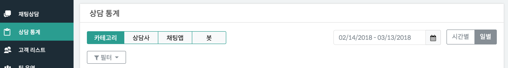
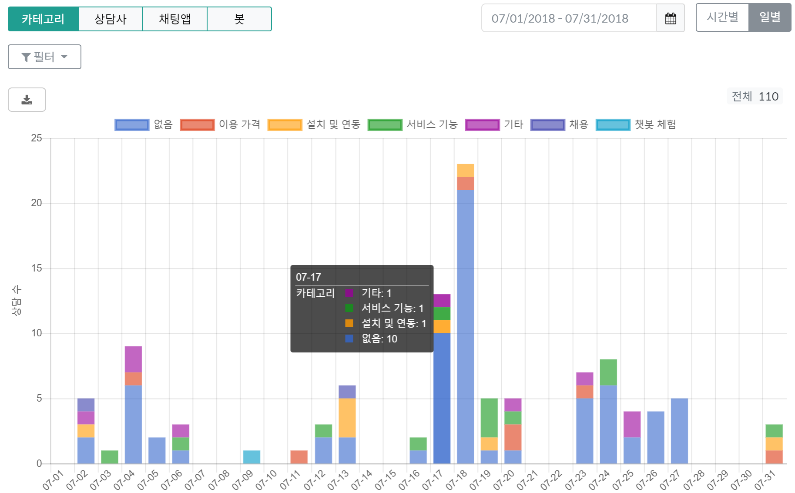
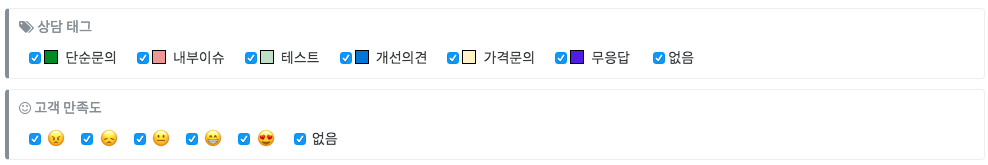
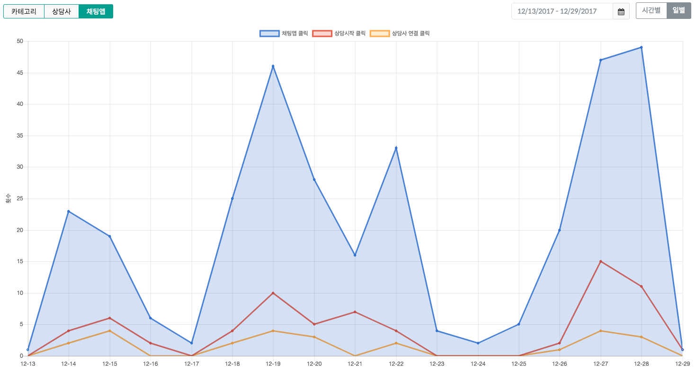
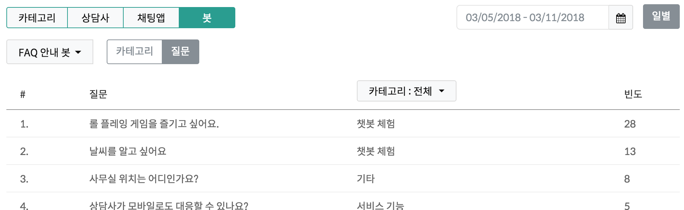

# 통계

현재 시간별(하루)/일별(기간설정) 통계를 확인할 수 있습니다.

#### 카테고리
    - 전체 상담 통계에 대해서 FAQ 카테고리별로 처리량을 확인
   
    * 기간
      - 시간별 - 특정 날짜에 대해서 한 시간 단위로 보기
      - 일별 - 시작 날짜와 끝 날짜를 지정해서 하루 단위로 보기
    * 필터
      - 상담 태그 - 선택한 태그에 해당하는 것만 보기
      - 고객 만족도 - 선택한 고객만족도에 해당하는 것만 보기
    * 다운로드
      - 통계 데이터 다운로드 (CSV 포맷)

   
#### 상담사
    - 전체 상담 통계에 대해서 상담사별로 처리량을 확인
#### 채팅앱
    - 고객들이 얼마나 채팅앱을 사용했는지를 한눈에 확인 
      - 채팅앱 클릭
      - 상담시작 클릭
      - 상담사연결 클릭
   
#### 봇
    - 봇 별로 의미있는 분석 데이터를 제공
    - FAQ 안내 봇 예시
      - 어떤 질문(혹은 카테고리)을 많이 이용했는지 순위별로 표시
   

---

© Gitple Inc. All Rights Reserved.
