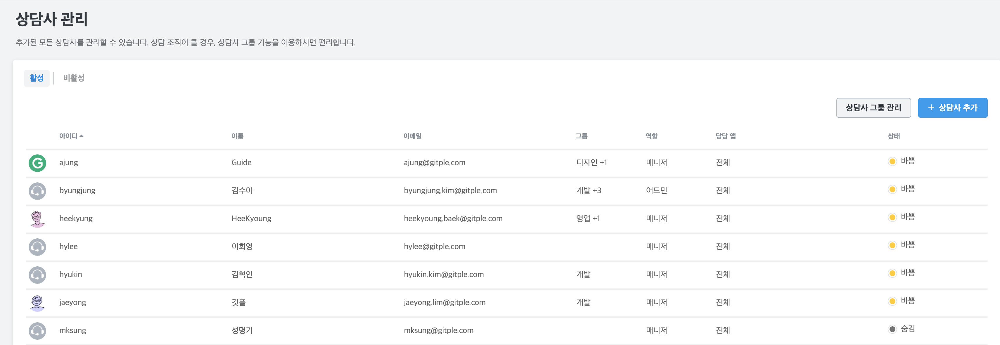
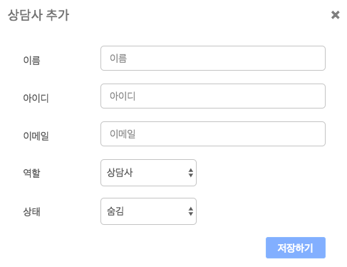

## 상담사 관리 {docsify-ignore}
관리자를 포함한 모든 상담사를 볼 수 있습니다.

### 역할 및 상태 변경
  맨 오른쪽 편집 아이콘을 선택하면, **역할 및 상태 변경**을 할 수 있습니다.

### 상담사 추가

  

  - 상담사를 추가하면, **초대되었다는 메일이 (최초 가입 환영 메일처럼) 자동으로 전송**됩니다.
  - 추가된 상담사의 경우엔 위 테이블의 맨 우측에 삭제 메뉴를 확인하실 수 있습니다.

### 상담사 상태
상담사 상태는 아래와 같이 3가지로 설정할 수 있습니다.
  * 상담 - 고객 상담 가능 상태

    
      - 위와 같이 자신의 상태를 변경할 수 있습니다.
  * 바쁨 - 다른 용무 중으로 일시적인 상담 불가 상태
  * 숨김 - 상담을 하지 않는 상태 (*참고: 모든 상담사가 숨김 상태면, 상담고객은 상담사 대기 조차 하지 않습니다.*)

---

© Gitple Inc. All Rights Reserved.
