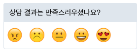
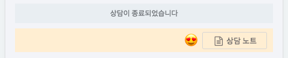

### 일반

#### 앱 이름

앱을 구분하는 이름을 지칭하게 됩니다. ([멀티 앱](https://guide.gitple.io/#/multiapp) 사용시)

#### FAQ 안내봇

자주 묻는 질문에 대해서는 FAQ봇이 24시간 언제나 고객 응대를 함으로써 상담사는 중요한 고객 문의에 더 집중할 수 있습니다.
* 문구 관리
  - FAQ 안내 봇 기능 활성화시, 각 안내 단계에 따른 기본 문구들을 수정할 수 있습니다.  
    예) **최초 시작, 카테고리 선택, 질문 선택** 등

* 입력 검색 활성화
  
  등록한 FAQ 데이터를 기반으로, 고객은 입력창에서 질문을 검색할 수 있습니다.
  
  - 입력을 허용하는 것이 기본 설정입니다.
  - 입력 검색을 허용하지 않고, 주어진 카테고리 및 질문 선택을 통해서만 고객을 맞이하려면 체크박스를 해제하시면 됩니다.

* 상담사 연결 버튼 표시
  
  고객이 FAQ 봇과 대화시 상담사 연결을 어느시점에 가능하게 할지 결정합니다.

  - **자동**: 기본 설정으로, FAQ 봇에서 상담사 연결이 필요할 경우 표시합니다.
    - 현재 FAQ 봇 진입 후 사용자가 카테고리를 하나라도 선택하거나, 질문 검색을 하는 경우에 표시되고 있습니다.
  - **항상**: FAQ 진입 시점부터 언제든지 상담사 연결을 바로 할 수 있도록 합니다.
  - **1단계 카테고리 선택 후**: 최소한 하나의 카테고리라도 선택(결정)된 경우에만 상담사 연결을 허용합니다.
  - **최종 단계 카테고리 선택 후**: 설정한 카테고리의 모든 단계를 진행하도록 합니다.
    - 즉, 더이상 선택할 카테고리가 없는 경우에 해당합니다.
  - **사용안함**: 상담사 없이 오직 FAQ 봇으로만 처리할 경우 사용합니다.

##### 메시지 접수

상담사가 바쁘거나 없을 때 상담사를 대신하여 고객의 상담 내용을 접수 받고 상담사에게 전달하여 24시간 고객상담을 지원합니다.

* 문구 관리
  - 메시지 접수 활성화시, 각 입력 라벨에 대한 기본 문구들을 수정합니다.  
    예) 연락처 정보, 상담받을 내용, 제출하기

* 모든 상담사가 대화중일 때 예시

  

##### 상담 평가

상담을 완료하는 시점에 고객으로부터 제공받은 상담에 대해서 만족도를 수집하여 상담의 질을 높일 수 있는 자료로 사용할 수 있습니다.

 * 문구 관리
   - 상담 평가시, 반응하는 기본 문구들을 수정합니다.  
     예) 최초 시작, 고객 만족도 (1, 2, 3, 4, 5)일 때 각 반응 문구 수정

 * 상담사가 대화를 종료하고 나가게 되면 아래와 같이 상담고객이 만족도를 평가할 수 있습니다.
   

 * 상담고객은 만족도 평가를 한 후 확인을 눌러 대화를 마칩니다. (이때 상담사는 개입되지 않습니다)

    

 * 만족도 결과는 이후에 상담노트 옆에 표시 됩니다. (통계 메뉴에서도 만족도로 필터링 가능)

    

##### 상담 안내

상담에 반드시 필요한 기본적인 안내 업무를 자동화하여 상담 효율성을 높입니다.

* 대기 고객에게 현재 대기 인원수 표시
  - 현재 몇명이 대기하고 있는지 대화창에 표시해 줍니다. (문구 변경 가능)
* 대기 고객이 메시지 접수시, 모든 상담사들한테 알림
  - 상담고객으로부터 메시지 접수가 발생한 경우에 알림이 발생합니다.
* 대기 고객이 상담 요청시 알림
  - `배정될 후보 상담사들에게` 설정의 경우, 전달 혹은 스킬배정에 의해 배정될 후보가 있으면 알림을 줍니다. (그렇지 않은 경우 모든 상담사들에게 알림과 동일)
* 해당 고객이 상담사와 배정시 알림
  - 실제 고객과 대화할 상담사에게만 알림을 원할때 `배정된 상담사에게` 를 설정하면 됩니다.

##### 채팅앱 지원 언어

채팅앱에서 지원할 언어를 추가 할 수 있습니다.

예를들어, 아래와 같이 영어를 기본언어로 설정함으로써, 영어사용 고객을 맞이할 수 있습니다.

팁 -  [다국어 고객지원 튜토리얼 바로가기](multilang.md)

##### 시간대

앱별로 타임존을 설정할 수 있습니다.
