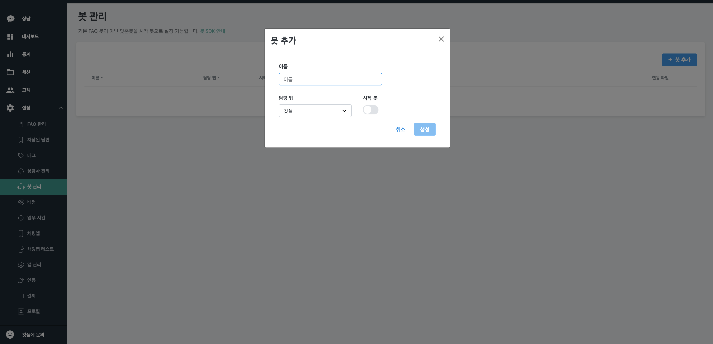

> 확장 인터페이스 봇을 통해 간단히 봇 연동 테스트를 진행하실 수 있습니다.


1. [Gitple-Bot-RiveScript SDK](https://github.com/gitple/gitple-bot-rivescript-node) 를 다운로드 하여 연동할 봇을 준비해주세요.

  봇 기동 방법은 [README](https://github.com/gitple/gitple-bot-rivescript-node/blob/master/README.md) 내용을 참고해주세요.

2. 워크스페이스 > 설정 > **봇 관리** 메뉴에서 봇을 추가하실 수 있습니다.

  

  **봇 관리** 메뉴를 선택해주세요.

  

3. **봇 추가** 버튼을 클릭하시고 봇 이름을 입력, 연동될 앱을 선택한 후 생성하시면 됩니다.

  필요에 따라 시작 봇 설정을 하실 수 있습니다. 시작 봇 설정 시에는 FAQ 안내 봇 설정이 사용함으로 되어있더라도 시작 봇이 우선됩니다.

  

4. 봇을 추가하시면 목록에서 추가된 봇을 확인하실 수 있습니다. 앞서 준비한 봇 연동을 위해 **연동 파일 다운로드 아이콘**을 클릭해주세요.

  

5. 다운로드 받은 **config.json** 파일을 준비한 봇의 config.json 파일과 교체해주세요.

  ```config.json
  # 각 정보는 선택된 앱과 각각의 봇에 따라 자동으로 생성됩니다.
  {
    "BOT_ID": BOT_ID,
    "BOT_GATEWAY_SECRET": BOT_GATEWAY_SECRET,
    "APP_CODE": APP_CODE
  }
  ```
6. 봇을 기동하시면 자동으로 워크스페이스 앱과 연동됩니다!!

  이제 채팅앱 테스트를 통해 연동을 확인하실 수 있습니다.

  [채팅앱 테스트](ws-inapp-test.md) ← 채팅앱 테스트 방법은 이 링크를 확인해주세요.

---

© Gitple Inc. All Rights Reserved.
