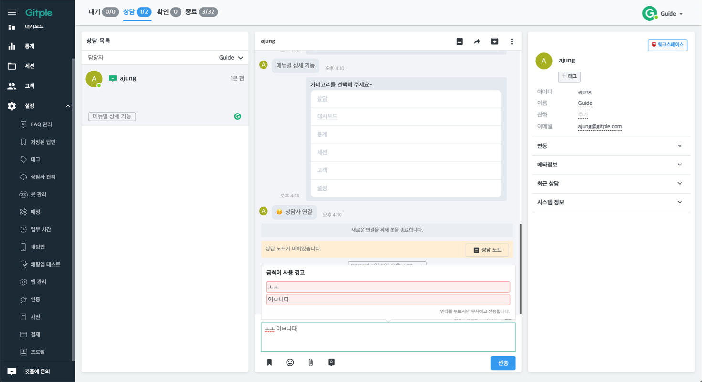

## 사전 {docsify-ignore}

유사어, 상담사 금칙어를 관리할 수 있습니다.

### 유사어
FAQ 검색을 좀더 원활하게 하기 위해, 검색이 안되는 유사어를 관리합니다.  

##### 유사어 등록하기

1. `설정` -> `사전` -> `유사어 추가` 버튼 클릭

`대표어` : FAQ 검색시, 질문이나 카테고리에 입력되어있는 대표 단어를 입력합니다.

`유사어` : 단어 추가를 눌러 설정한 유사어가 보여지는 항목입니다. 

`단어추가`: 대표어와 유사한 단어를 입력합니다. (ex. 대표어- 요금제, 단어추가- 비용, 금액 등)
  
    

##### 유사어 시나리오 예시
아래와 같은 다양한 시나리오에 적용할수 있습니다.   

1. FAQ: **서비스** 요금제는 어떻게 되나요?   
`대표어` : **요금제**, `유사어`: **비용,금액**

2. FAQ: 고객센터 **운영시간**은 언제인가요?   
`대표어` : **운영시간**, `유사어` : **업무시간**, **상담시간**

3. FAQ: **비밀번호**가 기억나지 않아요.  
`대표어` : **비밀번호**, `유사어` : **비번**, **암호**, **password**, **비번찾기**, **암호찾기**

---
### 금칙어
금칙어를 관리합니다.

* 상담 중에, 상담사가 사용하는 특정 단어를 제한할 목적으로 사용합니다.
* `금칙어 추가`버튼을 통해서 금칙어를 추가할 수 있습니다.
* 아래그림과 같이 언어별로 제한할 수 있습니다. ( 고객이 **브라우저에서 설정한 언어** 기준 )

* 상담사가 상담시 금칙어에 걸렸을때, 아래와 같은 화면이 나타납니다.
 예시: 'ㅎㅎ'을 의도했는데 옆의 모음인 'ㅗㅗ'로 잘못보내었을 시
  - `엔터`를 다시 누르면 해당 경고를 무시하고 내용을 보냅니다.  ( 금칙어 : `ㅗㅗ`, `이ㅂ니다`)

 
