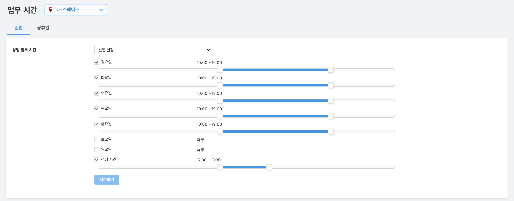
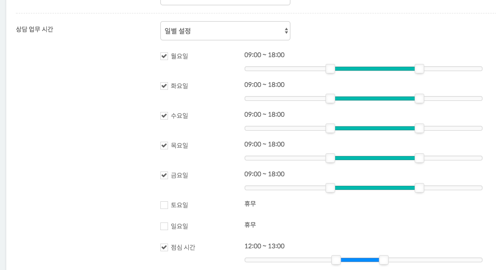

## 업무 시간 {docsify-ignore}

### 상담 업무 시간
* 항시 대응 혹은 일별 세부 설정 가능
  - "**일별 설정**"을 선택하면, 아래와 같이 설정 가능합니다. 또한, '**점심 시간**"을 추가로 설정할 수 있습니다.
  

### 공휴일 설정
* 다가오는 공휴일을 설정 가능
  - 하루 혹은 특정 기간을 명시하고 이름을 부여할 수 있습니다.
  - 해당 공휴일은 반복되는 것이 아닙니다. 즉, 해마다 반복되는 공휴일이더라도 추가로 지정해주셔야 합니다.