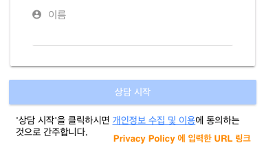

### 디자인

#### 테마 색상
상담 UI의 테마로 5가지 색상을 지원 (mint, blue, red, yellow, black)

#### 스타일 변경
기본 제공 테마 이외의 채팅앱 UI를 원하는 형태의 스타일로 변경할 수 있습니다. ([튜토리얼 참고](inapp-custom-style.md))

#### 아이콘 표시 방법 
웹 페이지내 채팅앱 아이콘이 어떻게 표시될지 설정

* 좌측하단 혹은 우측하단
* 아이콘 자동 표시
  - (체크함) 기본 제공되는 채팅앱을 화면에 표시함 (기본 설정)
  - (체크안함) 미리 링크 시켜 놓은 버튼, 이미지 또는 링크를 이용해서 채팅앱 실행 ([튜토리얼 참고](linkopen.md)) 
* 커스텀 아이콘 사용
  - 기본 제공되는 아이콘 외에 여러분만의 고유한 아이콘을 사용하고 싶은 경우에 체크 ([튜토리얼 참고](customicon.md))
    - 업로드할 파일 사이즈는 최대 3 MB로, 이미지 크기는 현재 자유롭게 지정가능합니다. 
  
#### 툴팁

?> 내용을 별도 페이지로 분리했습니다. [툴팁 사용방법](tooltip.md) 을 확인해 주세요.

#### 방문객
방문객이란 회원이 아니거나, 회원이라도 로그인하지 않은 사용자를 말합니다. 이러한 방문객의 채팅상담을 허용할지를 정합니다.

* 이메일, 전화, 이름에 대해서 **필수/선택/사용안함**을 고르시면 됩니다.
  - 아무런 입력도 받지 않을 경우에는 시스템에서 임의의 값을 해당 사용자한테 부여해서 구별합니다.

* 개인정보 수집 및 이용 동의 표시가 필요한 경우 사용합니다.
  - URL 입력창에 실제 위치한 개인정보 보호정책 및 이용약관의 링크를 명시해주세요.
  - 아래와 같이 표시 됩니다.

    

