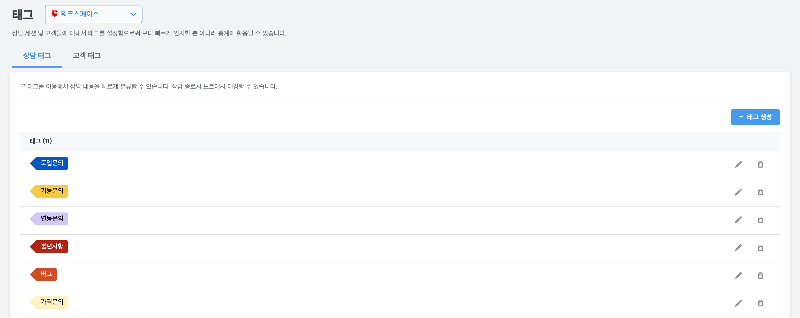
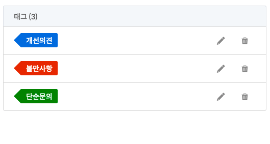
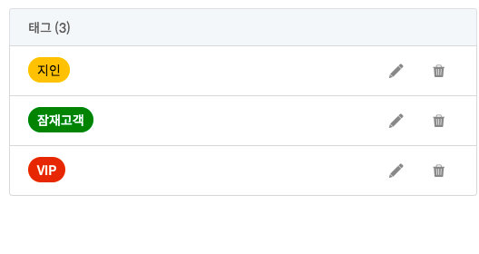

## 태그 {docsify-ignore}

태그를 통해서 보다 빠르고 상담을 분류하고, 체계적으로 관리(통계 처리 등)할 수 있습니다.

아래와 같이 두 가지 형태의 태그가 있으며, 각 예시 그림과 같이 응용할 수 있습니다.

### 상담 태그
상담 내용에 대해서 태그

  

### 사용자 태그
상담 고객에 대해서 태그

  

---

© Gitple Inc. All Rights Reserved.
