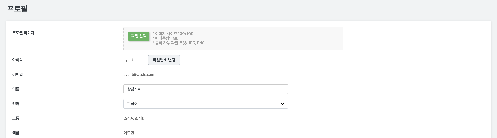
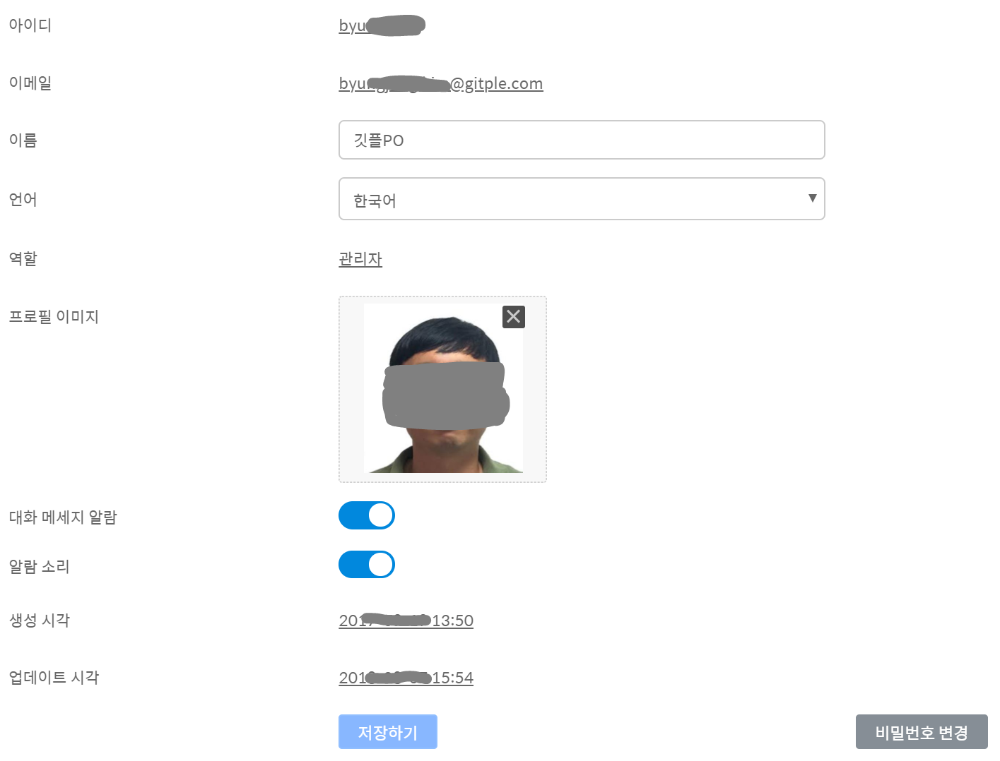

## 프로필 {docsify-ignore}

상담사의 개인 프로필을 설정합니다.

### 상세설명

프로필 작성후 **저장하기** 버튼을 눌러주세요

* 아이디
* 이메일
* 이름
* 언어
  - 한국어 및 영어 지원
* 역할
  - 관리자 혹은 일반 상담사
* 프로필 이미지
  - 워크스페이스 뿐만 아니라, 채팅앱에서도 표시됩니다.
* 대화메시지 알람
  - 상담이 배정된 고객이 새로운 메시지를 입력할 경우 데스크탑에 알림이 전달됩니다.
  - 알람이 발생 하려면
    - 크롬브라우저에서 데스크탑 알람 켜져 있고
    - 채팅상담 메인 페이지 (상담 목록)에 있을 경우
      (해당 창을 내리고 있는 경우나 다른 탭으로 가려져 있는 경우 포함)
* 알람 소리
  - 데스크탑 알람 발생시 소리도 함께 알려줍니다.
* 생성시각
* 업데이트 시각
* 비밀번호 변경
  - 비밀번호를 변경할 수 있습니다.

---

© Gitple Inc. All Rights Reserved.
