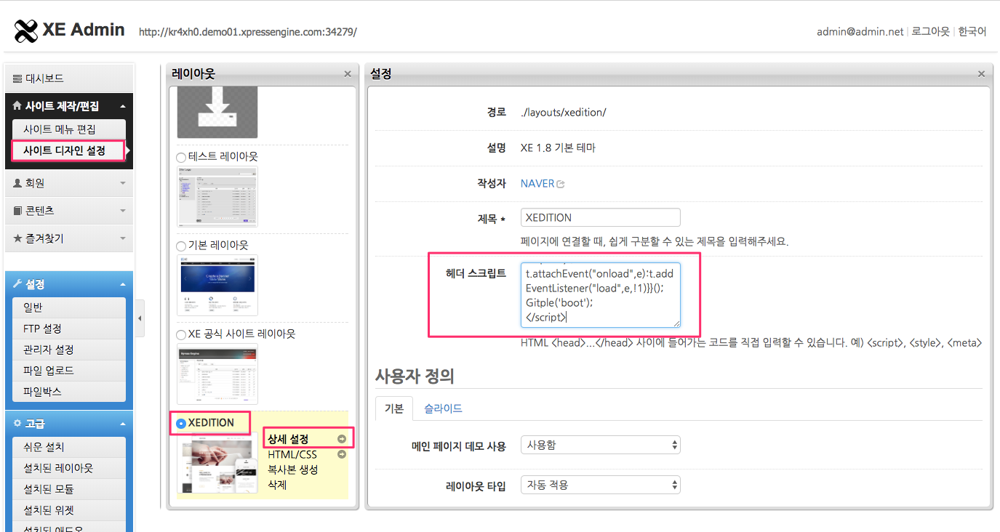
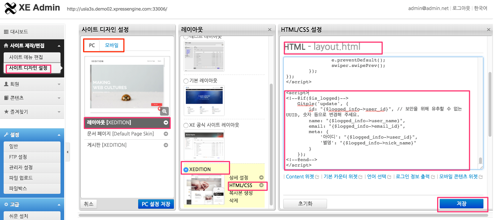

하이브리드 채팅상담 [깃플](https://gitple.io)

# XE1 연동 가이드

#### 1. 관리자로 로그인 한 후, `관리자 모드` > `사이트 제작/편집` > `사이트 디자인 설정` > `레이아웃 선택` > `상세 설정` 을 차례로 실행합니다.

 

#### 2. HTML 스크립트 복사하기
* 깃플 워크스페이스 > "설정 > 연동" > "웹연동 스크립트 코드" 속성에서 HTML 코드 복사
* XE1 의 레이아웃 설정 화면에서 `헤더 스크립트` 부분을 찾아, 위 그림엣 처럼 HTML 코드를 붙여넣음

!> 레이아웃 선택시 `PC` 뿐만 아니라 `모바일`까지 추가해 주세요. <br>
붙여넣기를 하신 후에, 화면 아래쪽의 `저장` 버튼을 누르기를 잊지 마세요.

### 서비스 시작

홈페이지에 접속해보시면, (기본) 오른쪽 하단에 여러분 만의 채팅상담 서비스가 가능해진 것을 확인할 수 있습니다.


### 로그인 사용자 연동 방법 안내

#### 관리자로 로그인 한 후, `관리자 모드` > `사이트 제작/편집` > `사이트 디자인 설정` > `레이아웃 선택` > `HTML/CSS` 을 차례로 실행합니다.

`HTML/CSS 설정` 화면에서 `HTML - layout.html` 부분을 찾아, 아래 코드를 추가합니다.

```php
<script>
<!--@if($is_logged)-->
    Gitple('update', {
        id: "{$logged_info->user_id}", // 보안을 위해 유추할 수 없는UUID(소문자), 숫자 등으로 변경해 주세요.
        name: "{$logged_info->user_name}",
        email: "{$logged_info->email_address}",
        meta: {
            '아이디': "{$logged_info->user_id}",
            '별명': "{$logged_info->nick_name}"
        }
    });
<!--@end-->
</script>
```



!> 레이아웃 선택시 `PC` 뿐만 아니라 `모바일`까지 추가해 주세요. <br>
붙여넣기를 하신 후에, 화면 아래쪽의 `저장` 버튼을 누르기를 잊지 마세요.

  * 단, id 는 보안을 위해 유추할 수 없는 UUID(소문자), 숫자 등으로 변경해 주세요.
  * meta 데이터에는 필요한 값을 추가해 사용하시면 됩니다.
  * [로그인 하지 않은 사용자에서 로그인 사용자로 변경](https://guide.gitple.io/#/web-sdk?id=로그인-하지-않은-사용자에서-로그인-사용자로-변경) 가이드를 참고해주세요.

이상입니다.

아직 계정이 없으시다구요? [무료 회원 가입](https://workspace.gitple.io/#/register)

---


© Gitple Inc. All Rights Reserved.
